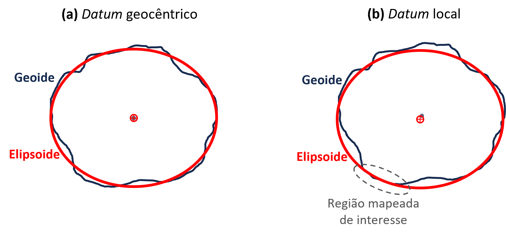
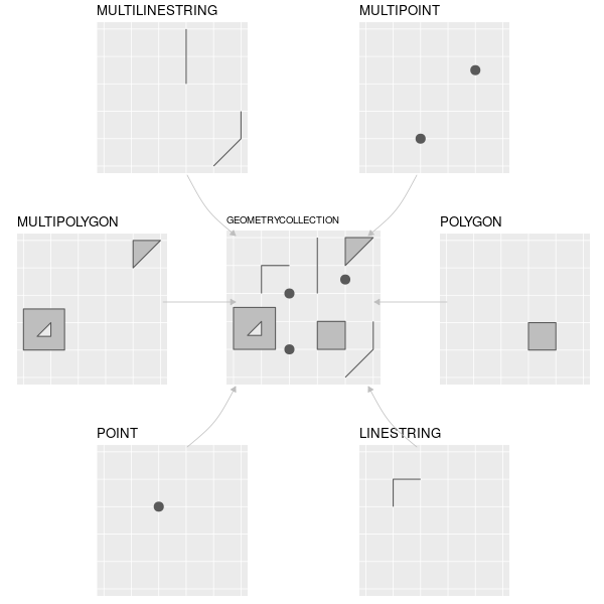

Praticamente toda questão relevante em política pública, planejamento urbano ou ciências sociais tem uma dimensão espacial: onde as pessoas moram, onde estão as escolas, quais bairros têm mais acesso a serviços de saúde. Incorporar essa dimensão à análise de dados exige um conjunto de conceitos e ferramentas específicos para trabalhar com dados geográficos.

Este capítulo é uma introdução ao tema. Há livros e disciplinas inteiras dedicados à análise espacial e ao geoprocessamento, a exemplo de [*Geocomputation with R*](https://r.geocompx.org/) [@lovelace_geocomputation_2025] e [*Spatial Statistics for Data Science*](https://www.paulamoraga.com/book-spatial/) [@moraga_spatial_2023]. Temos um objetivo mais modesto por aqui, que é o de apresentar os conceitos teóricos mínimos necessários para operar com dados geográficos em R e demonstrar as operações de geoprocessamento mais úteis no contexto das bases de dados brasileiras que ocupam os demais capítulos.

O foco recai inteiramente sobre dados vetoriais e como processá-los com o pacote `sf` (*simple features*), que é a principal biblioteca para esse tipo de dado no ecossistema R. Trabalharemos com diversos arquivos para executar as atividades ao longo do capítulo, que seguem abaixo. Desde já, recomendo que você faça o *donwload* dos mesmos para uma pasta em seu computador, crie um arquivo de projeto do R neste mesmo local e de um *script* `.R` para explorá-los conforme vá desenvolvendo a leitura do capítulo.

-   [`uf_br.gpkg`](https://github.com/pedreirajr/bdib/releases/download/datsets/uf_br.gpkg) — polígonos dos estados do Brasil
-   [`ssa.gpkg`](https://github.com/pedreirajr/bdib/releases/download/datsets/ssa.gpkg) — polígono do município de Salvador
-   [`bairros_ssa.geojson`](https://github.com/pedreirajr/bdib/releases/download/datsets/bairros_ssa.geojson) — polígonos dos bairros de Salvador
-   [`escolas_ssa.gpkg`](https://github.com/pedreirajr/bdib/releases/download/datsets/escolas_ssa.gpkg) — pontos das escolas de Salvador
-   [`smsl_est.gpkg`](https://github.com/pedreirajr/bdib/releases/download/datsets/smsl_est.gpkg) — estações do metrô de Salvador
-   [`smsl_linhas.gpkg`](https://github.com/pedreirajr/bdib/releases/download/datsets/smsl_linhas.gpkg) — linhas do metrô de Salvador
-   [`pop_uf_br.csv`](https://github.com/pedreirajr/bdib/releases/download/datsets/pop_uf_br.csv) — população por UF (Censo 2022)

```{r}
#| label: setup
#| include: false
library(tidyverse)
library(sf)
library(spData)
library(terra)
library(patchwork)
```

```{r}
#| label: leitura-dados
#| include: false
#| cache: true
#| message: false
url_base <- "https://github.com/pedreirajr/bdib/releases/download/datsets/"

uf_br      <- st_read(paste0(url_base, "uf_br.gpkg"),      quiet = TRUE)
ssa        <- st_read(paste0(url_base, "ssa.gpkg"),         quiet = TRUE)
bairros    <- st_read(paste0(url_base, "bairros_ssa.geojson"), quiet = TRUE)
escolas    <- st_read(paste0(url_base, "escolas_ssa.gpkg"), quiet = TRUE)
est_metro  <- st_read(paste0(url_base, "smsl_est.gpkg"),    quiet = TRUE)
lin_metro  <- st_read(paste0(url_base, "smsl_linhas.gpkg"), quiet = TRUE)
pop_uf     <- read_csv(paste0(url_base, "pop_uf_br.csv"), show_col_types = FALSE)
```

## Conceitos fundamentais

Antes de partir para o código, é preciso compreender o que torna um dado geográfico diferente de qualquer outra tabela de dados, e qual o papel dos sistemas de referência que tornam possível posicionar esses dados na superfície da Terra.

### Dado geográfico

Um dado geográfico é qualquer informação que possua referência explícita a uma localização na superfície da Terra. Essa localização pode ser absoluta, expressa em coordenadas (como latitude e longitude), ou relativa (como "200 m a leste da ponte"). A particularidade desse tipo de dado está exatamente nessa componente espacial, que abre um conjunto de análises impossíveis em uma tabela convencional, como medir proximidade entre entidades, identificar vizinhança, calcular áreas de cobertura ou detectar sobreposições entre fenômenos.

Estes tipos de dados se organizam em dois grandes modelos, conhecidos como vetorial e *raster*. No modelo **vetorial**, os fenômenos são representados por entidades discretas com geometria definida. Pontos representam localizações específicas (uma escola, uma estação de metrô, um poço). Linhas representam trajetórias ou redes (uma rua, uma linha de metrô, um rio). Polígonos representam áreas com fronteiras (um bairro, um município, um estado). A cada entidade geométrica se associa uma tabela de atributos, exatamente como em um *data frame* convencional.

No modelo ***raster***, a superfície é subdividida em uma grade regular de células (pixels), às quais podem ser atribuídos valores. Esse modelo é adequado para fenômenos contínuos e distribuídos, como elevação do terreno, temperatura, precipitação e uso do solo classificado por sensoriamento remoto. Em vez de fronteiras discretas, o *raster* captura gradações no espaço.

```{r}
#| label: fig-vetor-raster
#| echo: false
#| message: false
#| warning: false
#| fig-cap: "Os dois modelos de dados geográficos: vetorial (esquerda), com entidades discretas representadas por pontos, linhas e polígonos; e raster (direita), com a superfície dividida em uma grade de células, cada uma armazenando um valor (aqui, elevação do terreno em metros)."
#| fig-width: 10
#| fig-height: 4

# --- Lado vetorial (ggplot2 puro, sem sf, para ilustração) ---
poly_coords <- data.frame(
  x = c(0.8, 3.8, 3.8, 0.8, 0.8),
  y = c(0.8, 0.8, 4.2, 4.2, 0.8)
)
line_coords <- data.frame(
  x = c(0.5, 2.0, 4.0, 5.5, 7.5, 9.5),
  y = c(6.0, 7.5, 6.5, 8.2, 7.0, 8.5)
)
point_coords <- data.frame(
  x = c(5.5, 7.0, 8.8, 6.5, 9.2),
  y = c(2.0, 1.5, 2.8, 3.8, 4.5)
)

p_vetor <- ggplot() +
  geom_polygon(data = poly_coords, aes(x = x, y = y),
               fill = "steelblue", alpha = 0.55,
               color = "steelblue4", linewidth = 0.8) +
  geom_path(data = line_coords, aes(x = x, y = y),
            color = "tomato", linewidth = 1.5,
            lineend = "round", linejoin = "round") +
  geom_point(data = point_coords, aes(x = x, y = y),
             color = "#2e7d32", size = 4) +
  annotate("text", x = 2.3, y = 0.1,
           label = "Polígono", color = "steelblue4",
           size = 3.8, fontface = "bold") +
  annotate("text", x = 4.8, y = 9.5,
           label = "Linha", color = "tomato",
           size = 3.8, fontface = "bold") +
  annotate("text", x = 7.5, y = 5.3,
           label = "Pontos", color = "#2e7d32",
           size = 3.8, fontface = "bold") +
  coord_cartesian(xlim = c(0, 10), ylim = c(0, 10)) +
  labs(title = "Vetorial") +
  theme_void() +
  theme(
    plot.title    = element_text(hjust = 0.5, face = "bold",
                                 size = 13, margin = margin(b = 8)),
    plot.background = element_blank(),
    plot.margin   = margin(10, 10, 10, 10)
  )

# --- Lado raster: agrega para ampliar as células e usar geom_tile ---
r     <- rast(system.file("ex/elev.tif", package = "terra"))
r_agg <- aggregate(r, fact = 6)
r_df  <- as.data.frame(r_agg, xy = TRUE)
names(r_df)[3] <- "valor"

p_raster <- ggplot(r_df, aes(x = x, y = y, fill = valor)) +
  geom_tile(color = "white", linewidth = 0.4) +
  scale_fill_gradientn(
    colors = c("#4575b4", "#91bfdb", "#e0f3f8",
               "#ffffbf", "#fee090", "#fc8d59", "#d73027"),
    guide  = "none"
  ) +
  labs(title = "Raster") +
  theme_void() +
  theme(
    plot.title      = element_text(hjust = 0.5, face = "bold",
                                   size = 13, margin = margin(b = 8)),
    plot.background = element_blank(),
    plot.margin     = margin(10, 10, 10, 10)
  )

p_vetor + p_raster + plot_layout(widths = c(1, 1))
```

A divisão entre os dois modelos acompanha, em geral, a natureza das perguntas de pesquisa. As ciências sociais, em geral, ao trabalhar com assentamentos humanos, redes de transporte e divisões administrativas, fazem uso intensivo de dados vetoriais. As ciências ambientais e o sensoriamento remoto se apoiam predominantemente em dados *raster*. Neste capítulo, teremos um foco em operações de geoprocessamento mais voltadas para dados vetoriais.

### Sistema de Referência de Coordenadas (SRC)

O *Sistema de Referência de Coordenadas* (SRC) é esse o contexto que define como um par de coordenadas se traduz em uma posição real na superfície terrestre. Todo dado geográfico precisa de um SRC para ser interpretado corretamente, sendo composto por três elementos articulados entre si: o *datum*, o sistema de coordenadas e, no caso de dados projetados, a projeção cartográfica.

#### *Datum*

A Terra não é uma esfera perfeita nem um elipsoide regular. Sua forma real, influenciada pela gravidade e pela distribuição de massas internas, é chamada de *geoide*. O geoide é a superfície teórica que representa o nível médio dos mares estendido por baixo dos continentes, formando uma superfície de igual potencial gravitacional.

Como o geoide é muito irregular para ser usado diretamente em geoprocessamento, costumamos utilizar outra entidade, o *elipsoide*. Este, por sua vez, trata-se de uma superfície matemática regular que aproxima a forma da Terra, definida por dois parâmetros (o raio equatorial e o achatamento polar) e que serve de base para os cálculos de coordenadas. A relação entre estes elementos pode ser melhor observada na @fig-geoide-elipsoide.

<!-- "Na área oceânica (esquerda), o geoide encontra-se acima do elipsoide; ambos ficam abaixo do relevo topográfico nos continentes (direita)." Correto? -->

```{r}
#| label: fig-geoide-elipsoide
#| echo: false
#| message: false
#| warning: false
#| fig-cap: "Relação esquemática entre o relevo topográfico, o geoide e o elipsoide. O geoide (azul) é uma superfície irregular determinada pelo campo gravitacional da Terra, que coincide com o nível médio dos mares estendido sob os continentes. O elipsoide (cinza) é uma superfície matemática regular e lisa que aproxima a forma da Terra."
#| fig-width: 8
#| fig-height: 3.5

x <- seq(0, 10, length.out = 500)

# Terrain: flat (ocean floor) on left, rises from geoid level at ocean boundary, mountain on right
t_ctrl <- data.frame(
  x = c(0,  0.5, 1,  1.5, 2,  2.5, 2.8, 3,   3.5, 4,   4.5, 5,   5.5, 6,   6.5, 7,   7.5, 8,   8.5, 9,   9.5, 10),
  y = c(0,  0,   0,  0,   0,  0,   0.4, 0.9, 1.1, 1.5, 2.2, 3.0, 3.7, 4.2, 4.5, 4.7, 4.9, 4.7, 4.1, 3.5, 3.1, 2.8)
)

# Geoid: wavy, near sea level
g_ctrl <- data.frame(
  x = c(0,    1,    2,    3,    4,    5,    6,    7,    8,    9,    10),
  y = c(1.05, 0.82, 1.12, 0.90, 1.00, 1.18, 1.32, 1.48, 1.36, 1.28, 1.22)
)

# Ellipsoid: smooth, below geoid throughout
e_ctrl <- data.frame(
  x = c(0,    2,    5,    8,    10),
  y = c(0.52, 0.68, 0.95, 1.20, 1.28)
)

t_y <- pmax(spline(t_ctrl$x, t_ctrl$y, xout = x)$y, 0)
g_y <- spline(g_ctrl$x, g_ctrl$y, xout = x)$y
e_y <- spline(e_ctrl$x, e_ctrl$y, xout = x)$y

df       <- data.frame(x = x, terrain = t_y, geoid = g_y, ellipsoid = e_y)
df_ocean <- df[df$x <= 3.2, ]  # ocean area (left, where terrain ≈ 0)

ggplot(df) +
  # Ocean water fill (baseline to geoid, left side)
  geom_ribbon(data = df_ocean,
              aes(x = x, ymin = 0, ymax = geoid),
              fill = "#9ecae1", alpha = 0.75, color = NA) +
  # Terrain fill (sandy beige)
  geom_ribbon(aes(x = x, ymin = 0, ymax = terrain),
              fill = "#d9c49a", color = NA) +
  # Terrain outline
  geom_line(aes(x = x, y = terrain),
            color = "#c4a870", linewidth = 0.6) +
  # Baseline
  geom_segment(x = 0, xend = 10, y = 0, yend = 0,
               color = "gray30", linewidth = 0.7) +
  # Geoid (blue, wavy)
  geom_line(aes(x = x, y = geoid),
            color = "#1565C0", linewidth = 1.3) +
  # Ellipsoid (gray, smooth)
  geom_line(aes(x = x, y = ellipsoid),
            color = "#757575", linewidth = 1.3) +
  # Text labels
  annotate("text", x = 1.15, y = 1.18,
           label = "Geóide",         color = "#1565C0", size = 4, fontface = "italic") +
  annotate("text", x = 4.10, y = 0.59,
           label = "Elipsoide",      color = "#757575", size = 4, fontface = "italic") +
  annotate("text", x = 8.60, y = 5.10,
           label = "Relevo\ntopográfico", color = "#7a5c2e", size = 3.8) +
  annotate("text", x = 1.00, y = -0.45,
           label = "oceanos",        color = "gray25", size = 3.8) +
  annotate("text", x = 7.00, y = -0.45,
           label = "continentes",    color = "gray25", size = 3.8) +
  scale_y_continuous(limits = c(-0.7, 5.5)) +
  scale_x_continuous(limits = c(0, 10)) +
  theme_void() +
  theme(plot.background = element_blank())
```

O *datum* define qual elipsoide utilizar e como ancorá-lo ao planeta, estabelecendo um ponto de referência que relaciona a superfície matemática à superfície física da Terra. Um aspecto importante a ser mencionado é que um *datum* pode ser **geocêntrico** ou **local**, conforme se pode observar na @fig-datum_loc_geo. Um *datum* **geocêntrico**, como o WGS84 (o sistema global usado pelo GPS), posiciona o centro do elipsoide no centro de massa da Terra e é otimizado para uso em escala global. Um *datum* **local**, por sua vez, ajusta o elipsoide à superfície em uma região específica, sendo mais preciso naquela área à custa de distorções em outras.

Vale salientar que o sistema oficial de referência no Brasil é o SIRGAS 2000 (*Sistema de Referência Geocêntrico para as Américas*), um *datum* geocêntrico compatível com o WGS84 para a maioria das aplicações práticas.

{#fig-datum_loc_geo}

#### Sistema de coordenadas

O sistema de coordenadas define os eixos e as unidades que permitem localizar pontos dentro do *datum*, podendo ser de dois tipos principais: **geográfico** e **projetado**. Um sistema de coordenadas **geográfico** expressa a posição em latitude e longitude, medidas em graus. A latitude varia de −90° (polo sul) a +90° (polo norte), enquanto a longitude varia de −180° a +180°. É o sistema mais familiar e universal, adotado por GPS, mapas *web* e a maioria dos arquivos geográficos distribuídos publicamente. Um sistema de coordenadas **projetado**, por sua vez, expressa a posição em coordenadas cartesianas (X e Y) sobre um plano, geralmente em metros. Para chegar a esse plano, é necessária uma projeção cartográfica, o último aspecto a tratarmos neste tópico de SRC.

```{r, echo = F}
#| label: fig-src-comparacao
#| fig-cap: "Dois sistemas de referência de coordenadas: geográfico com visão global em WGS84 (acima) e projetado em UTM fuso 23S aplicado à América do Sul (abaixo)."
#| fig-width: 7
#| fig-height: 9
#| cache: true
#| message: false
#| warning: false

data(world, package = "spData")

fill_color   <- "#C8884A"
border_color <- "#7A5020"
grid_color   <- "gray75"

map_theme <- theme_minimal() +
  theme(
    plot.background  = element_rect(fill = "transparent", color = NA),
    panel.background = element_rect(fill = "transparent", color = NA),
    panel.grid.major = element_line(color = grid_color, linewidth = 0.35),
    axis.text        = element_text(size = 8, color = "gray50"),
    plot.title       = element_text(hjust = 0.5, size = 12, face = "bold"),
    plot.subtitle    = element_text(hjust = 0.5, size = 9, color = "gray40")
  )

p_geo <- world |>
  ggplot() +
  geom_sf(fill = fill_color, color = border_color, linewidth = 0.15) +
  coord_sf(crs = "+proj=ortho +lat_0=25 +lon_0=15") +
  labs(title = "SRC Geográfico — WGS84 (EPSG 4326)") +
  map_theme

p_proj <- world |>
  filter(continent == "South America") |>
  st_transform(32723) |>
  ggplot() +
  geom_sf(fill = fill_color, color = border_color, linewidth = 0.15) +
  coord_sf(datum = sf::st_crs(32723)) +
  labs(title = "SRC Projetado — UTM Fuso 23S (EPSG 32723)") +
  map_theme

p_geo / p_proj
```

#### Projeção cartográfica

A Terra é esférica, mas um mapa é plano. Para representar a superfície curva do planeta em duas dimensões, é preciso deformá-la matematicamente. Esse processo é o que se chama de projeção cartográfica. Toda projeção introduz distorções inevitáveis, e cada tipo prioriza preservar uma ou duas propriedades geométricas (área, forma, distância ou direção) às custas das demais.

As projeções são classificadas pela superfície geométrica usada como intermediária entre o globo e o plano (@fig-projecoes). Na **projeção azimutal** (ou plana), projeta-se a superfície terrestre sobre um plano tangente ao globo, geralmente no polo. O resultado é um mapa circular centrado no ponto de tangência, com distorções crescentes à medida que se afasta do centro. Na **projeção cônica**, envolve-se o globo com um cone que o toca ao longo de um ou dois paralelos; ao se abrir o cone em um plano, obtém-se um mapa em forma de setor, com distorções menores próximas aos paralelos de tangência. Na **projeção cilíndrica**, o globo é envolvido por um cilindro; ao abri-lo, obtém-se um mapa retangular. A projeção de Mercator (talvez a mais conhecida) é cilíndrica e preserva formas e ângulos locais, sendo útil para navegação. Apesar disso, distorce severamente a propriedade de área. Por exemplo, a Groenlândia aparece com área similar à da África, embora tenha apenas 7% da área continental africana.

.](img/5-dados-geograficos/5-5-projecoes.png){#fig-projecoes}

Uma outra projeção bastante notória é a UTM (*Universal Transverse Mercator*), que é cilíndrica, mas aplicada de forma transversal e segmentada. Em vez de um único cilindro envolvendo o mundo inteiro, o UTM divide o globo em 60 fusos verticais de 6° de longitude cada, numerados de 1 a 60. Para cada fuso, aplica-se um cilindro transversal que minimiza as distorções naquela faixa estreita. O Brasil ocupa principalmente os fusos 19 a 25, e a escolha do fuso correto é essencial para que distâncias e áreas sejam matematicamente precisas.

Na prática, para visualização e intercâmbio de dados, o SRC geográfico (lat/lon em graus) é o mais conveniente. Para análises quantitativas que envolvam medição de distâncias, cálculo de áreas ou criação de zonas de influência, é necessário um SRC projetado com unidades métricas.

#### Codificação EPSG

Com centenas de sistemas de referência disponíveis, é preciso uma forma padronizada de identificá-los. A IOGP (*International Association of Oil & Gas Producers*, antiga *European Petroleum Survey Group*) publica o EPSG Geodetic Parameter Dataset, um banco de dados que atribui um código numérico único a cada SRC, *datum*, elipsoide e operação de transformação registrados.

Os códigos EPSG aparecem frequentemente em arquivos geográficos e funções de geoprocessamento. A tabela abaixo reúne os mais relevantes para as análises com dados brasileiros.

| Código EPSG | SRC                        | Tipo       | Unidade |
|-------------|----------------------------|------------|---------|
| 4326        | WGS84                      | Geográfico | Graus   |
| 4674        | SIRGAS 2000                | Geográfico | Graus   |
| 31983       | SIRGAS 2000 / UTM fuso 23S | Projetado  | Metros  |
| 31984       | SIRGAS 2000 / UTM fuso 24S | Projetado  | Metros  |
| 5880        | SIRGAS 2000 / Policônico   | Projetado  | Metros  |
| 3857        | Web Mercator               | Projetado  | Metros  |

Com os conceitos de SRC estabelecidos, é possível avançar para o lado prático sobre como trabalhar com dados geográficos no R, tema das nossas próximas seções.

## Dados vetoriais e o pacote `sf` para R

O pacote `sf` (*simple features*) é a principal biblioteca para dados geográficos **vetoriais** no R. Ele implementa o padrão ISO 19125, conhecido como *Simple Features*, que define como representar e operar sobre geometrias vetoriais de forma consistente. Internamente, o `sf` se apoia em quatro bibliotecas escritas em C++:

-   **GDAL** (*Geospatial Data Abstraction Library*): leitura e escrita de dezenas de formatos geográficos, como GeoPackage, GeoJSON, Shapefile e outros.
-   **GEOS** (*Geometry Engine, Open Source*): operações geométricas como buffers, interseções e uniões em coordenadas projetadas.
-   **PROJ**: transformações entre sistemas de referência de coordenadas.
-   **s2geometry**: operações geométricas em coordenadas geográficas (longitude/latitude), tratando a Terra como uma esfera. Usada por padrão desde a versão 1.0 do `sf`.

Em geoprocessamento, uma **camada vetorial** é um conjunto de feições do mesmo tipo geométrico, organizado como uma tabela. Os três componentes fundamentais de uma camada vetorial são:

-   **Feição** (*feature*): cada linha da tabela corresponde a uma feição (um elemento geográfico individual), como um município, um trecho de rodovia ou uma escola. Cada feição tem uma geometria e um conjunto de atributos.
-   **Campos** (*fields*) ou **atributos**: as colunas não-espaciais da tabela, que descrevem características de cada feição (nome, código, população, área, etc.). No R, são acessados como colunas normais de um *data frame*.
-   **Geometria**: a coluna especial que armazena a representação espacial de cada feição (ponto, linha ou polígono). No `sf`, essa coluna é da classe `sfc` e geralmente se chama `geometry` ou `geom`.

Além desses três componentes, toda camada vetorial carrega **metadados** que descrevem suas propriedades globais. Eles aparecem automaticamente ao imprimir um objeto `sf`. Os metadados incluem o número de feições e campos, o tipo de geometria, a caixa delimitadora e o sistema de referência de coordenadas.

O objeto `sf` de uma camada vetorial comporta-se essencialmente como um *data frame*. Isso significa que todas as operações do `dplyr` (`filter()`, `mutate()`, `left_join()` etc.) funcionam diretamente sobre objetos `sf`, tornando o fluxo de trabalho coeso com o restante do `tidyverse`.

### Tipos de geometria

O padrão *Simple Features* define 18 tipos de geometria. Na prática, utilizamos mais as seis primeiras das sete principais abaixo, ilustradas na @fig-tipos-geometria:

-   `POINT`: um único ponto (uma escola, uma estação de metrô).
-   `LINESTRING`: uma sequência de pontos conectados (uma rua, uma linha de metrô).
-   `POLYGON`: uma área fechada (um bairro, um município).
-   `MULTIPOINT`: coleção de pontos pertencentes à mesma feição.
-   `MULTILINESTRING`: coleção de linhas pertencentes à mesma feição (ex.: ruas descontínuas).
-   `MULTIPOLYGON`: coleção de polígonos pertencentes à mesma feição (um estado com ilhas, por exemplo).
-   `GEOMETRYCOLLECTION`: mistura de tipos geométricos em uma única feição.

{#fig-tipos-geometria}

Cada tipo tem uma representação textual padronizada chamada *WKT* (*Well-Known Text*), que é o formato utilizado internamente pelo `sf` para descrever geometrias. Conhecer essa notação é útil para interpretar mensagens de erro, inspecionar objetos e criar geometrias manualmente. A função `st_as_sfc()` converte uma *string* WKT (no formato de texto, entre aspas) em um objeto de geometria do `sf`.

Um `POINT` é o tipo mais simples: um único par de coordenadas x y separadas por espaço, onde x corresponde à longitude e y à latitude:

```{r}
#| label: wkt-point
#| message: false
st_as_sfc("POINT (-38.51 -12.96)")
```

Um `LINESTRING` é uma sequência de pares x y separados por vírgula. O `sf` os conecta em ordem, formando segmentos de reta para uma mesma linha:

```{r}
#| label: wkt-linestring
#| message: false
st_as_sfc("LINESTRING (-38.51 -12.96, -38.49 -12.97, -38.48 -13.00)")
```

Um `POLYGON` define uma área fechada por um anel de coordenadas. Por isso, o último par deve ser idêntico ao primeiro. Os quatro pares únicos abaixo definem os três cantos de um triângulo, sendo que o quarto par fecha o anel voltando ao ponto de origem. Os parênteses são duplos porque o padrão WKT reserva os parênteses internos para representar furos no polígono (não utilizados no exemplo abaixo).

```{r}
#| label: wkt-polygon
#| message: false
st_as_sfc("POLYGON ((-38.52 -12.95, -38.47 -12.95, -38.47 -13.01, -38.52 -12.95))")
```

Um `MULTIPOINT` reúne dois ou mais pontos em uma única feição. Cada ponto fica entre seus próprios parênteses internos. O importante é que, na tabela, os dois pontos abaixo correspondem a uma só linha da tabela (uma única feição com duas localizações):

```{r}
#| label: wkt-multipoint
#| message: false
st_as_sfc("MULTIPOINT ((-38.51 -12.96),
                       (-38.49 -12.97))")
```

Um `MULTILINESTRING` reúne dois ou mais trechos de linha em uma única feição. Cada trecho fica entre seus próprios parênteses. O exemplo abaixo cria uma feição com dois segmentos, como os dois sentidos de uma avenida representados como traços separados.

```{r}
#| label: wkt-multilinestring
#| message: false
st_as_sfc("MULTILINESTRING ((-38.51 -12.96, -38.49 -12.97),
                            (-38.48 -13.00, -38.47 -13.01))")
```

Um `MULTIPOLYGON` reúne dois ou mais polígonos em uma única feição. É o tipo mais frequente nas bases brasileiras. Estados e municípios com ilhas têm o território continental e as ilhas como polígonos distintos, mas compõem uma única feição na tabela. Cada polígono fica entre parênteses duplos (o nível interno reservado ao anel, o externo ao agrupamento), resultando em três níveis de parênteses no total.

```{r}
#| label: wkt-multipolygon
#| message: false
st_as_sfc("MULTIPOLYGON (((-38.52 -12.95, -38.47 -12.95, -38.47 -13.01, -38.52 -12.95)),
                         ((-38.45 -12.94, -38.43 -12.94, -38.43 -12.96, -38.45 -12.94)))")
```

### Criando camadas vetoriais do zero

Para entender a estrutura de objetos `sf`, é útil criá-los do zero. Em vez de descrever geometrias como texto WKT, podemos utilizar funções do pacote `sf`, como `st_point()`, `st_linestring()` e `st_polygon()`, que recebem vetores e matrizes de coordenadas. O resultado de cada uma é um objeto de geometria individual (`sfg`), que depois é agrupado em uma coluna de geometrias com `st_sfc()` e associado a um *data frame* de atributos com `st_sf()`, formando uma camada vetorial completa.

O exemplo abaixo cria três pontos (estações hipotéticas de metrô), uma linha (o traçado hipotético) e um polígono (um bairro hipotético), todos referenciados ao *datum* SIRGAS 2000 (EPSG 4674):

```{r}
#| label: geometrias-scratch
#| message: false

# Três pontos: estações hipotéticas
p1 <- st_point(c(-38.510, -12.960))
p2 <- st_point(c(-38.495, -12.975))
p3 <- st_point(c(-38.480, -13.005))

estacoes_hip <- st_sf(
  nome = c("Estação A", "Estação B", "Estação C"),
  geometry = st_sfc(p1, p2, p3, crs = 4674)
)

# Uma linha: traçado hipotético
linha_hip <- st_sf(
  nome = "Linha Hipotética",
  geometry = st_sfc(
    st_linestring(
      matrix(c(-38.510, -12.960,
               -38.495, -12.975,
               -38.480, -13.005),
             ncol = 2, byrow = TRUE)
    ),
    crs = 4674
  )
)

# Um polígono: bairro hipotético
poligono_hip <- st_sf(
  nome = "Bairro Hipotético",
  geometry = st_sfc(
    st_polygon(list(
      matrix(c(-38.520, -12.950,
               -38.470, -12.950,
               -38.470, -13.015,
               -38.520, -13.015,
               -38.520, -12.950),
             ncol = 2, byrow = TRUE)
    )),
    crs = 4674
  )
)
```

O resultado das operações anteriores produzem os seguintes arquivos geográficos abaixo, que aprenderemos a visualizar em R logo mais:

```{r, echo = FALSE}
#| label: fig-geometrias-scratch
#| fig-cap: "Objeto `sf` criado do zero com três tipos de geometria: um polígono, uma linha e três pontos — todos referenciados ao datum SIRGAS 2000."
ggplot() +
  geom_sf(data = poligono_hip, fill = "lightblue", alpha = 0.4) +
  geom_sf(data = linha_hip, color = "steelblue", linewidth = 1) +
  geom_sf(data = estacoes_hip, color = "steelblue", size = 3) +
  theme_minimal()
```

Dois aspectos merecem atenção. Primeiro, o SRC é definido no momento da criação (`crs = 4674`). Sem ele, o objeto `sf` existiria, mas seria espacialmente indefinido. Segundo, a estrutura resultante é um *data frame* comum: `estacoes_hip` tem linhas (uma por estação), colunas de atributos (`nome`) e uma coluna de geometria.

### Lendo Arquivos Geográficos com `st_read()`

Mais comum do que criarmos arquivos geográficos do zero é lermos arquivos existentes de alguma base de dados. Eles podem assumir diversos formatos (extensões) predefinidos, como GeoPackage (`.gpkg`), GeoJSON (`.geojson`), Shapefile (`.shp`), entre outros. A função `st_read()` lê qualquer um desses formatos e devolve um objeto `sf`.

Antes de prosseguir com o código abaixo, lembre-se de fazer o download dos arquivos listados no início do capítulo, salve-os em uma pasta e inicie um porjeto no RStudio[^5-dados-geograficos-1]. Na sequência, em um script `.R`, use os comandos abaixo para carregá-los:

[^5-dados-geograficos-1]: se você estiver usando Positron, esta etapa não é necessária

```{r}
#| eval: false
library(tidyverse)
library(sf)

uf_br   <- st_read("uf_br.gpkg")
ssa     <- st_read("ssa.gpkg")
bairros <- st_read("bairros_ssa.geojson")
escolas <- st_read("escolas_ssa.gpkg")
est_metro <- st_read("smsl_est.gpkg")
lin_metro <- st_read("smsl_linhas.gpkg")
pop_uf  <- read_csv("pop_uf_br.csv")
```

Após carregar, use `st_crs()` para inspecionar o SRC de qualquer objeto:

```{r}
st_crs(uf_br)
```

Note que o *output* acima gera diversos metadados relativos ao SRC do objeto espacial. Se quisermos de forma específica somente o código EPSG do SRC da camada, podemos fazer:

```{r}
st_crs(uf_br)$epsg
st_crs(bairros)$epsg
st_crs(escolas)$epsg
```

Observe que os estados do Brasil (`uf_br`) e as escolas (`escolas`) estão em SIRGAS 2000 (EPSG 4674). Os bairros de Salvador (`bairros`) estão em WGS84 (EPSG 4326). Essa diferença de SRC entre camadas é algo a ser observado antes de qualquer operação que combine duas ou mais delas.

### Visualizando Dados Geográficos

É possível plotar esses arquivos geográficos com apoio do pacote `ggplot2`, oriundo da família de pacotes `tidyverse`, que já vimos no capítulo anterior. Para tanto, utilizaremos a função `geom_sf()` para mapeá-los de maneira sobreposta, conforme o exemplo abaixo. É importante destacar que o `ggplot2` reconhece objetos `sf` automaticamente por meio da função `geom_sf()`.

Comecemos com o mapa de estados armazenado no objeto `sf` denominado `uf_br`, que contém feições (polígonos) relativos a cada estado do Brasil. Antes de plotá-lo, vale examinar sua estrutura:

```{r}
#| label: print-uf-br
uf_br
```

O cabeçalho do output mostra os metadados da camada: 27 feições (uma por estado), 5 campos de atributos, tipo de geometria `MULTIPOLYGON` (cada estado pode ter ilhas e descontinuidades), as coordenadas das extremidades da caixa delimitadora (`Bounding box`) que compreende do território brasileiro e o SRC SIRGAS 2000. Logo abaixo aparecem as primeiras linhas da tabela, com os campos `code_state`, `abbrev_state`, `name_state`, `code_region` e `name_region`, além da coluna `geom`, que armazena a geometria de cada feição.

O argumento de geometria (`geom_`) que utilizamos no `ggplot2` para visualizar arquivos vetoriais é o `geom_sf()`, conforme pode ser visto para a camada dos estados brasileiros abaixo:

```{r}
#| label: fig-uf-simples
#| fig-cap: "Mapa dos estados do Brasil, lidos do arquivo `uf_br.gpkg` e plotados com `geom_sf()`."
uf_br |>
  ggplot() +
  geom_sf() +
  theme_minimal()
```

Podemos produzir mapas coropléticos com base em colunas da própria base de dados ou cores determinadas *a priori* de nosso interesse. A coloração dos polígonos segue o padrão estético do ggplot2 definidos em `aes()`, com o parâmetro `fill` representando a cor de *preenchimento* e `color` a coloração das *bordas*. Perceba, no caso abaixo, que `fill` foi definido dentro de `aes()`, pois a coloração depende do valor da coluna `name_region`, ao passo que `color` foi escolhido arbitrariamente com a cor branca, fora de `aes()`, sem depender dos valores de qualquer coluna da base de dados.

```{r}
#| label: fig-uf-regiao
#| fig-cap: "Estados do Brasil coloridos por grande região geográfica."
uf_br |>
  ggplot() +
  geom_sf(aes(fill = name_region), color = "white", linewidth = 0.2) +
  theme_minimal()
```

Já vimos anteriormente que é possível agregar duas bases de dados por meio de uma operação de junção (*join*). O mesmo pode ser feito entre objetos espaciais `sf` e aqueles em formatos de tabela (`data.frame` ou `tibble`, por exemplo). No exemplo abaixo, construiremos um mapa coroplético adicionando dados de população do arquivo `pop_uf_br.csv` ao objeto `uf_br` com um `left_join()`, antes de plotar:

```{r}
#| label: fig-uf-pop
#| fig-cap: "Mapa coroplético com a população dos estados do Brasil no Censo 2022."
uf_br |>
  left_join(pop_uf, by = join_by(abbrev_state == sigla)) |>
  ggplot() +
  geom_sf(aes(fill = pop2022), color = "white", linewidth = 0.2) +
  theme_minimal()
```

Do mesmo modo, também é possível sobrepor múltiplas camadas no mesmo mapa passando cada uma a um `geom_sf()` com o argumento `data`. No caso abaixo, conseguimos visualizar três tipos de arquivos vetoriais (polígonos, linhas e pontos), com diferentes estilos visuais. Observe que para modificar a coloração de linhas e pontos utilizamos o argumento `color`, uma vez que eles não têm preenchimento[^5-dados-geograficos-2].

[^5-dados-geograficos-2]: Para o caso de pontos, há a possibilidade de alterar o preenchimento com o argumento `fill` quando definimos o formato dos pontos com o argumento `shape` nos tipos 21 a 25, que compreendem círculos, quadrados e losangos, por exemplo, onde é possível também definir a cor do contorno/borda com o argumento `color`

```{r}
#| label: fig-salvador-camadas
#| fig-cap: "Bairros de Salvador com as estações e as linhas do metrô sobrepostos."
ggplot() +
  geom_sf(data = bairros, fill = "gray92", color = "gray70", linewidth = 0.2) +
  geom_sf(data = lin_metro, color = "steelblue", linewidth = 1) +
  geom_sf(data = est_metro, color = "navyblue", size = 2) +
  theme_minimal()
```

### Visualizando de Forma Interativa

O pacote `mapview` oferece uma alternativa interativa ao `ggplot2` para explorar dados geográficos. Em vez de uma imagem estática, ele gera um mapa navegável com zoom e pan, sobreposto a uma camada de base como OpenStreetMap ou imagens de satélite. É especialmente útil na fase exploratória da análise, quando queremos inspecionar feições individuais ou verificar a coerência espacial dos dados.

Para utilizá-lo, basta passar um objeto `sf` à função `mapview()`. O resultado é imediato, sem nenhuma configuração estética:

```{r}
#| label: mapview-poligono
library(mapview)
mapview(bairros)
```

```{r}
#| label: mapview-linha
mapview(lin_metro)
```

```{r}
#| label: mapview-ponto
mapview(est_metro)
```

<br>

Para sobrepor múltiplas camadas, o `mapview` usa o operador `+`, da mesma forma que o `ggplot2`:

```{r}
#| label: mapview-conjunto
mapview(bairros) + mapview(lin_metro) + mapview(est_metro)
```

<br>

A função aceita argumentos para controlar a aparência de cada camada. Para polígonos, `zcol` define a coluna usada para colorir as feições, `col.regions` recebe o vetor de cores e `color` controla a cor das bordas. No exemplo abaixo, colorimos os estados por grande região geográfica com cores predefinidas:

```{r}
#| label: mapview-uf-regiao
cores_regiao <- c(
  "Norte"        = "#2ca25f",
  "Nordeste"     = "#e6550d",
  "Centro-Oeste" = "#756bb1",
  "Sudeste"      = "#e31a1c",
  "Sul"          = "#2b8cbe"
)

mapview(uf_br,
        zcol = "name_region",
        col.regions = cores_regiao,
        color = "white")
```

<br>

Para linhas e pontos, os principais argumentos estéticos são `color` (cor), `lwd` (espessura da linha), `cex` (tamanho do ponto) e `alpha` / `alpha.regions` (transparência da borda e do preenchimento, respectivamente, numa escala de 0 a 1). O exemplo abaixo mostra as linhas e estações do metrô de Salvador com estilos diferenciados num mesmo mapa:

```{r}
#| label: mapview-metro
mapview(lin_metro,
        color = "steelblue",
        lwd = 4,
        alpha = 0.75) +
mapview(est_metro,
        col.regions = "navyblue",
        color = "white",
        cex = 7,
        alpha.regions = 0.9)
```

<br>

Com a leitura e a visualização de dados dominadas, o próximo passo é transformar essas camadas: recortá-las, combiná-las, medir distâncias e extrair relações espaciais. Esse conjunto de operações é o que se chama de geoprocessamento.

## Geoprocessamento

Geoprocessamento é qualquer transformação lógica ou matemática que extraia, relacione ou sintetize informação contida nas geometrias e nos atributos de um dado geográfico. Para dados tabulares, o `dplyr` oferece `filter()`, `mutate()` e `summarize()`. Para dados geográficos, o `sf` oferece um conjunto análogo de funções que operam sobre as geometrias.

As seções a seguir percorrem as operações mais frequentes, na ordem em que naturalmente se encadeiam: reprojeção primeiro (pré-requisito para operações métricas), depois as operações geométricas propriamente ditas.

### Reprojeção

Como visto na seção sobre SRC, análises que envolvam distâncias, áreas ou zonas de influência exigem um SRC projetado com unidades métricas. A função `st_transform()` converte um objeto `sf` de um SRC para outro, recebendo como argumento o código EPSG do sistema de destino.

Antes de criar buffers de 600 metros ao redor das estações de metrô, por exemplo, é necessário reprojetar as estações de SIRGAS 2000 geográfico (EPSG 4674) para SIRGAS 2000 UTM fuso 24S (EPSG 31984), o SRC projetado adequado para Salvador:

```{r}
#| label: reprojecao-metro
est_metro_utm  <- st_transform(est_metro, crs = 31984)
lin_metro_utm  <- st_transform(lin_metro, crs = 31984)

st_crs(est_metro_utm)$epsg
```

Sempre que for criar buffers, calcular áreas ou medir distâncias, verifique o SRC com `st_crs()` e reprojeite se necessário.

### Centroides

Um centroide é o ponto que representa o centro geométrico de um polígono. Ele é útil em diversas situações: como referência para rotular feições em um mapa, como ponto de origem em análises de acessibilidade, ou como posição aproximada de uma área para cálculos de distância.

A função `st_centroid()` calcula esse centro geométrico. Para a maioria dos polígonos, o resultado cai dentro da feição. Mas para polígonos com formas côncavas ou compostos por partes separadas (como um estado que inclui ilhas), o centroide matemático pode cair fora do polígono, o que em geral não é desejável. A alternativa é `st_point_on_surface()`, que garante que o ponto retornado esteja sempre dentro do polígono, mesmo que não seja o centro geométrico. Para rotular mapas ou gerar pontos de referência confiáveis, `st_point_on_surface()` é a escolha mais robusta. Veja no exemplo abaixo os centroides dos bairros de salvador sendo gerados pelas duas alternativas. Para os formados com a `st_centroid()` desenhamos o ponto como um círculo avermelhado e para aqueles do `st_point_on_surface()` com um triângulo (`shape = 17`) azulado.

```{r}
#| label: fig-centroides-comparacao
#| fig-cap: "Centroides calculados com `st_centroid()` (em vermelho) e com `st_point_on_surface()` (em azul) para os bairros de Salvador. Nos polígonos côncavos, `st_centroid()` pode cair fora da feição, enquanto `st_point_on_surface()` garante um ponto interno."
#| message: false
#| warning: false
bairros_cent  <- st_centroid(bairros)
bairros_pos   <- st_point_on_surface(bairros)

ggplot() +
  geom_sf(data = bairros, fill = "gray92", color = "gray70", linewidth = 0.2) +
  geom_sf(data = bairros_cent, color = "tomato",  size = 1.5) +
  geom_sf(data = bairros_pos,  color = "steelblue", size = 1.5, shape = 17) +
  theme_minimal()
```

### *Buffers*

Um *buffer* é uma zona de influência gerada ao redor de uma feição, delimitada por uma distância definida. Ele responde a perguntas como "o que está a menos de 600 metros de cada estação de metrô?" ou "qual área fica a menos de 200 metros da linha de metrô?".

A função `st_buffer()` funciona sobre qualquer tipo de geometria: ao redor de um ponto, gera um círculo; ao redor de uma linha, gera uma faixa paralela; ao redor de um polígono, expande seus limites. O argumento `dist` especifica a distância em unidades do SRC — por isso a reprojeção para UTM é indispensável antes de criar buffers.

```{r}
#| label: fig-buffer-estacoes
#| fig-cap: "Buffer de 600 metros ao redor das estações do metrô de Salvador (SIRGAS 2000 UTM fuso 24S)."
bff_estacoes <- st_buffer(est_metro_utm, dist = 600)

ggplot() +
  geom_sf(data = bairros, fill = "gray92", color = "gray70", linewidth = 0.2) +
  geom_sf(data = bff_estacoes, fill = "steelblue", alpha = 0.35, color = NA) +
  geom_sf(data = est_metro_utm, color = "steelblue", size = 2) +
  theme_minimal()
```

O mesmo raciocínio se aplica à linha do metrô:

```{r}
#| label: fig-buffer-linha
#| fig-cap: "Buffer de 200 metros ao redor da linha do metrô de Salvador, combinado com o buffer de 600 metros das estações."
bff_linha <- st_buffer(lin_metro_utm, dist = 200)

ggplot() +
  geom_sf(data = bairros, fill = "gray92", color = "gray70", linewidth = 0.2) +
  geom_sf(data = bff_linha,    fill = "#f0500f", alpha = 0.30, color = NA) +
  geom_sf(data = bff_estacoes, fill = "steelblue", alpha = 0.35, color = NA) +
  geom_sf(data = lin_metro_utm, color = "#f0500f", linewidth = 1) +
  geom_sf(data = est_metro_utm, color = "steelblue", size = 2) +
  theme_minimal()
```

### União

`st_union()` funde todas as feições de uma camada em uma única geometria, dissolvendo as fronteiras internas. O resultado é um objeto com uma única feição.

Um uso típico é construir o contorno de um município a partir dos polígonos dos seus bairros:

```{r}
#| label: fig-uniao-bairros
#| fig-cap: "União de todos os bairros de Salvador em um único polígono com `st_union()`."
bairros_unidos <- st_union(bairros)

ggplot() +
  geom_sf(data = bairros_unidos, fill = "gray80", color = "gray40") +
  theme_minimal()
```

### Dissolução

Enquanto `st_union()` funde tudo em uma única feição, a dissolução agrupa feições de acordo com um atributo e as funde dentro de cada grupo. No `sf`, isso é feito com a combinação `group_by()` + `summarize()` do `dplyr`, pois o `sf` reconhece automaticamente que as geometrias dentro de cada grupo devem ser unidas. Ainda assim, é boa prática escrever `geom = st_union(geom)` explicitamente no `summarize()`, deixando claro que a coluna de geometria está sendo agregada por união, tornando o código mais legível e o comportamento previsível independentemente da versão do `sf`.

O exemplo abaixo agrega os estados brasileiros por região, calculando a população total de cada uma. Repare no uso de `st_make_valid()` antes do agrupamento. Sem ele, a dissolução pode gerar geometrias espúrias. Ao tentar unir os estados do Sudeste, por exemplo, `st_union()` pode devolver um `LINESTRING` solto junto do polígono, porque as bordas compartilhadas entre estados têm sobreposição topológica. Neste caso, em vez de cancelar essas bordas, a função as "sobra" como uma geometria separada. `st_make_valid()` corrige essas inconsistências antes de processar.

```{r}
#| label: fig-dissolucao-regioes
#| fig-cap: "Regiões do Brasil obtidas pela dissolução dos estados, com coloração proporcional à população (Censo 2022)."
#| message: false
#| warning: false

regioes_br <- uf_br |>
  left_join(pop_uf, by = join_by(abbrev_state == sigla)) |>
  st_make_valid() |>
  group_by(name_region) |>
  summarize(pop_total = sum(pop2022, na.rm = TRUE), geom = st_union(geom))

regioes_br |>
  ggplot() +
  geom_sf(aes(fill = pop_total), color = "white", linewidth = 0.3) +
  theme_minimal()
```

Observe que mesmo após `st_make_valid()`, o mapa pode exibir riscos internos visíveis nos polígonos das regiões. Eles são as fronteiras entre estados que não foram completamente dissolvidas. Isso acontece porque estados adjacentes podem ter bordas com pequenas discrepâncias de coordenadas: vértices que deveriam coincidir perfeitamente estão deslocados por frações de grau. O `st_union()` só dissolve uma borda compartilhada se ela for geometricamente idêntica nos dois polígonos. Se houver qualquer diferença mínima, os dois polígonos permanecem como partes separadas dentro do `MULTIPOLYGON`, e o `geom_sf()` desenha a borda de cada parte.

### Interseção

`st_intersection()` recorta as geometrias de uma camada pelo contorno das feições de outra, devolvendo os fragmentos resultantes com os atributos das duas camadas reunidos em cada fragmento.

Uma aplicação direta é identificar quais porções de cada bairro de Salvador estão dentro da área de influência do metrô. Neste caso, será retornado, para cada *buffer* de estação de metrô, a área de interseção dos bairros com esses *buffers* em uma tabela com atributos de ambas as bases de dados para cada combinação **buffer** X bairro intersectada. Por exemplo, se o **buffer** de uma estação de metrô M tem interseção com dois bairros A e B, o resultado terá duas linhas com as feições da interseção do *buffer* com o bairro A e do *buffer* com o bairro B, juntamente com as colunas de atributos das bases originais correspondentes a cada uma destas feições.

Para produzir este resultado, é importante que ambas as camadas precisam estejam no mesmo SRC:

```{r}
#| label: fig-intersecao-metro-bairros
#| fig-cap: "Porções dos bairros de Salvador que estão dentro do buffer de 600 metros das estações do metrô."
#| message: false
#| warning: false

bairros_utm <- st_transform(bairros, 31984)

inter_metro_bairros <- st_intersection(bff_estacoes, bairros_utm)

ggplot() +
  geom_sf(data = bairros_utm, fill = "gray92", color = "gray70", linewidth = 0.2) +
  geom_sf(data = inter_metro_bairros, fill = "steelblue", alpha = 0.6, color = 'black') +
  theme_minimal()
```

Cada linha do objeto `inter_metro_bairros` corresponde a uma fatia de bairro coberta por algum *buffer*. Os atributos de ambas as camadas originais (identificador da estação e nome do bairro) estão presentes, o que permite sumarizar a cobertura por bairro ou por estação.

### Filtragem e Junção Espacial

Filtrar e juntar camadas espacialmente são duas operações que, ao contrário da interseção geométrica, não produzem novas geometrias. O que ambas fazem é usar a posição relativa entre feições para selecionar ou enriquecer dados. Para isso, as duas operações dependem de um mecanismo comum: o predicado espacial.

#### Predicados Espaciais

Um **predicado espacial** é uma função que testa a relação geométrica entre as feições de duas camadas. No `sf`, todas as funções de predicado têm a mesma forma: `st_<predicado>(x, y)`. Nenhuma geometria é modificada e o resultado é sempre uma afirmação sobre a relação entre elas.

O output padrão é um objeto da classe `sgbp` (*sparse geometry binary predicate*), que é uma lista com um elemento por feição de `x`, contendo os **índices** das feições de `y` que satisfazem o predicado. Para feições sem nenhuma correspondência, o elemento é um vetor inteiro vazio (`integer(0)`).

No código abaixo, reprojetamos os bairros para UTM e aplicamos `st_intersects()` em relação aos buffers das estações. Em seguida, inspecionamos a classe do resultado, os índices retornados para o primeiro bairro e o número de correspondências para cada bairro com `lengths()`.

```{r}
#| label: predicado-output
#| message: false
bairros_utm <- st_transform(bairros, 31984)
resultado <- st_intersects(bairros_utm, bff_estacoes)
class(resultado)    # "sgbp"
resultado[[1]]      # índices dos buffers que intersectam o primeiro bairro
lengths(resultado)  # número de correspondências para cada bairro
```

Com `sparse = FALSE`, o resultado é uma matriz lógica com uma linha por feição de `x` e uma coluna por feição de `y`. O código abaixo extrai as três primeiras linhas para ilustrar a estrutura:

```{r}
#| label: predicado-matrix
mat <- st_intersects(bairros_utm, bff_estacoes, sparse = FALSE)
mat[1:3, ]
```

Os principais predicados disponíveis no `sf` são descritos abaixo. Todos compartilham o mesmo formato de output (`sgbp` ou matriz lógica).

**`st_intersects(x, y)`**: o predicado mais amplo. Retorna `TRUE` sempre que as geometrias têm qualquer ponto em comum, seja sobreposição de interior ou apenas toque de fronteira. É o predicado padrão de `st_filter()` e `st_join()`, que veremos mais adiante.

No exemplo abaixo, contamos quantos bairros têm ao menos um buffer de estação sobreposto:

```{r}
#| label: pred-intersects
res_intersects <- st_intersects(bairros_utm, bff_estacoes)
length(res_intersects[lengths(res_intersects) > 0])
```

**`st_within(x, y)`**: retorna `TRUE` se `x` está completamente dentro de `y`, sem que nenhum ponto de `x` esteja fora de `y`. É mais restritivo que `st_intersects`.

O código abaixo conta quantas escolas estão completamente dentro de algum buffer de estação:

```{r}
#| label: pred-within
#| message: false
escolas_utm <- st_transform(escolas, 31984)
res_within <- st_within(escolas_utm, bff_estacoes)
length(res_within[lengths(res_within) > 0])
```

**`st_contains(x, y)`**: inverso lógico de `st_within`, retornando `TRUE` se `x` contém completamente `y`. O código abaixo conta quantas escolas cada buffer contém:

```{r}
#| label: pred-contains
res_contains <- st_contains(bff_estacoes, escolas_utm)
lengths(res_contains)
```

**`st_touches(x, y)`**: retorna `TRUE` se as geometrias se tocam apenas na fronteira, sem sobreposição de interior. É o predicado adequado para identificar polígonos adjacentes. O código abaixo identifica os estados que fazem fronteira com a Bahia:

```{r}
#| label: pred-touches
bahia <- uf_br[uf_br$abbrev_state == "BA", ]
res_touches <- st_touches(uf_br, bahia)
uf_br$name_state[lengths(res_touches) > 0]
```

**`st_crosses(x, y)`**: retorna `TRUE` se as geometrias compartilham parte do interior mas nenhuma contém completamente a outra. É especialmente útil para verificar se linhas cruzam polígonos. O código abaixo verifica se a linha do metrô cruza algum bairro:

```{r}
#| label: pred-crosses
#| message: false
lin_metro_utm <- st_transform(lin_metro, 31984)
res_crosses <- st_crosses(lin_metro_utm, bairros_utm)
res_crosses
```

**`st_disjoint(x, y)`**: retorna `TRUE` se não há nenhum ponto em comum entre as geometrias. É o complemento exato de `st_intersects`. O código abaixo conta quantas escolas não têm nenhuma proximidade com o metrô:

```{r}
#| label: pred-disjoint
res_disjoint <- st_disjoint(escolas_utm, bff_estacoes)
length(res_disjoint[lengths(res_disjoint) > 0])
```

#### Filtro Espacial

Quando o objetivo é selecionar feições de uma camada que satisfaçam uma condição espacial em relação a outra, `st_filter()` aplica um predicado para filtrar as feições da primeira camada, mantendo as geometrias originais intactas, sem recortá-las.

O código abaixo seleciona as escolas de Salvador que intersectam a área de influência do metrô (buffer de 600 m) e as plota em destaque:

```{r}
#| label: fig-filtro-escolas-metro
#| fig-cap: "Escolas de Salvador dentro do buffer de 600 metros das estações do metrô (destacadas em laranja)."
#| message: false
#| warning: false

escolas_utm <- st_transform(escolas, 31984)

escolas_no_metro <- st_filter(escolas_utm, bff_estacoes, .predicate = st_intersects)

ggplot() +
  geom_sf(data = bairros_utm, fill = "gray92", color = "gray70", linewidth = 0.2) +
  geom_sf(data = bff_estacoes, fill = "steelblue", alpha = 0.25, color = NA) +
  geom_sf(data = escolas_utm, color = "gray60", size = 0.8) +
  geom_sf(data = escolas_no_metro, color = "tomato", size = 1.5) +
  theme_minimal()
```

O argumento `.predicate` recebe qualquer um dos predicados vistos anteriormente. Para garantir que os pontos estejam completamente dentro dos polígonos, por exemplo, basta usar `.predicate = st_within`.

#### Junção Espacial

Nos capítulos anteriores, os `join()` do `dplyr` combinam tabelas por colunas com valores em comum. A junção espacial faz o equivalente, usando a localização geográfica como chave e transferindo os atributos de uma camada para outra com base na posição relativa. O predicado usado é definido pelo argumento `join`, sendo `st_within` o mais comum: ele transfere os atributos de um polígono para todos os pontos que estão dentro dele.

O código abaixo atribui o nome do bairro a cada escola de Salvador:

```{r}
#| label: fig-join-escolas-bairros
#| fig-cap: "Escolas de Salvador após a junção espacial com os bairros: cada escola recebeu o nome do bairro em que está inserida."
#| message: false
#| warning: false

escolas_sirgas <- st_transform(escolas, 4674)
bairros_sirgas <- st_transform(bairros, 4674)

escolas_com_bairro <- escolas_sirgas |>
  st_join(bairros_sirgas |> select(nome_bairr), join = st_within)

ggplot() +
  geom_sf(data = bairros_sirgas, fill = "gray92", color = "gray70", linewidth = 0.2) +
  geom_sf(data = escolas_com_bairro, aes(color = nome_bairr), size = 0.8, show.legend = FALSE) +
  theme_minimal()
```

Após a junção, a coluna `nome_bairr` está disponível no objeto `escolas_com_bairro`, permitindo agregações como contar o número de escolas por bairro ou calcular a razão escolas-por-habitante quando combinada com dados populacionais.

Com essas operações, é possível extrair uma grande variedade de informações espaciais a partir das bases geográficas que aparecem nos capítulos seguintes. Os exercícios a seguir propõem uma aplicação integrada com dados de saúde da Bahia.

## Exercícios

Faça o download dos arquivos abaixo e salve-os na mesma pasta de trabalho:

-   [`estab_sau_ba.gpkg`](https://github.com/pedreirajr/bdib/releases/download/datsets/estab_sau_ba.gpkg) — estabelecimentos de saúde da Bahia
-   [`reg_sau_ba.gpkg`](https://github.com/pedreirajr/bdib/releases/download/datsets/reg_sau_ba.gpkg) — regiões de saúde da Bahia

**Exercício 1.** Carregue os dois arquivos com `st_read()`. Verifique o SRC de cada um com `st_crs()`. Plote ambas as camadas no mesmo mapa: as regiões de saúde como polígonos e os estabelecimentos como pontos.

**Exercício 2.** Reprojeite os dois objetos para SIRGAS 2000 Policônico (EPSG 5880), um SRC projetado adequado para análises em escala do Brasil.

**Exercício 3.** Calcule o centroide de cada região de saúde usando `st_point_on_surface()`. Plote os centroides sobre o mapa das regiões.

**Exercício 4.** Crie um buffer de 20 km ao redor dos centroides das regiões de saúde. Lembre-se de que o SRC já está em metros (EPSG 5880), então o argumento `dist` deve ser `20000`.

**Exercício 5.** Use `st_intersection()` para obter os estabelecimentos de saúde que estão dentro do buffer de 20 km de cada centroide. Quantos estabelecimentos existem em cada região?

**Exercício 6.** Ordene as regiões de saúde por número de estabelecimentos no buffer (do maior para o menor) e apresente o resultado em uma tabela com `knitr::kable()`.
