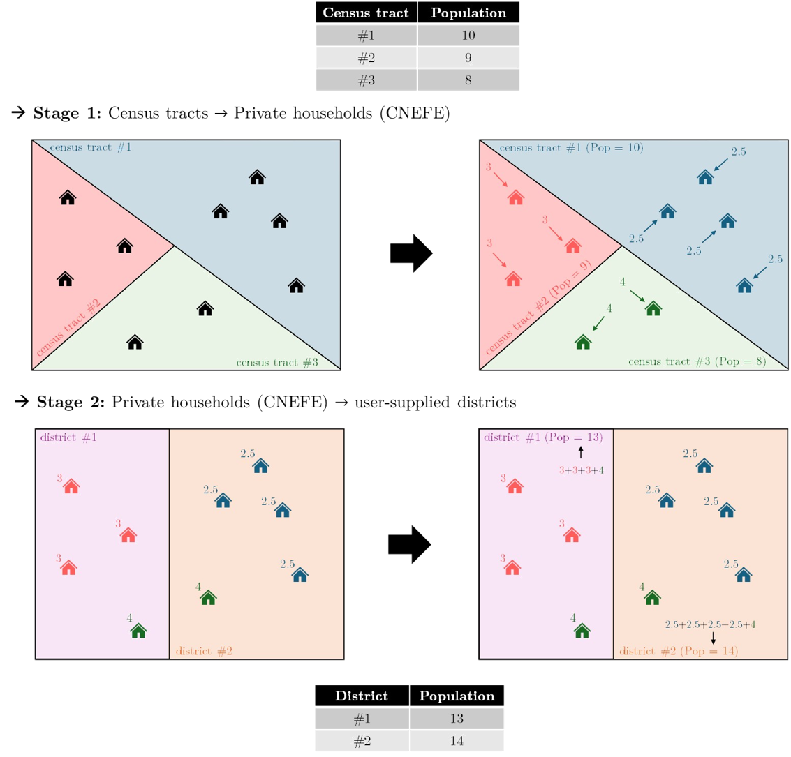

## O produto mais popular do Censo

Dentre todos os produtos do Censo Demográfico, os **Agregados por Setores Censitários** são, sem dúvida, os mais amplamente utilizados por pesquisadores, planejadores e gestores públicos. Trata-se de um conjunto de tabelas em que cada linha representa um setor censitário e cada coluna representa uma variável agregada, como o total de moradores, o número de domicílios, as condições de abastecimento de água e esgotamento sanitário, a composição etária da população, entre muitas outras.

A popularidade desse produto decorre de uma característica que o distingue de outras fontes, uma vez que ele representa o equilíbrio entre resolução espacial e quantidade de estatísticas disponível por unidade espacial. Enquanto os microdados da amostra permitem análises mais ricas em termos de variáveis (renda, educação, migração), as **áreas de ponderação** (unidade espacial dos microdados) são muito maiores que os setores censitários. A grade estatística, por sua vez, oferece resolução ainda maior, mas com um número menor de variáveis disponíveis. Para ilustrar, no Censo de 2010, por exemplo, o município de São Paulo possuía 5.082 setores censitários, mas apenas 107 áreas de ponderação, conforme ilustra a @fig-sp-comparacao.

```{r}
#| label: fig-sp-comparacao
#| fig-cap: "Setores censitários e áreas de ponderação do município de São Paulo (Censo 2010)."
#| fig-subcap:
#|   - "5.082 setores censitários"
#|   - "107 áreas de ponderação"
#| layout-ncol: 2
#| echo: false
#| cache: true
#| message: false

sp_sc <- geobr::read_census_tract(code_tract = 3550308, year = 2010, simplified = TRUE)
sp_ap <- geobr::read_weighting_area(code_weighting = 3550308, year = 2010, simplified = TRUE)

ggplot(sp_sc) +
  geom_sf(fill = "gray92", color = "gray70", linewidth = 0.05) +
  theme_minimal()

ggplot(sp_ap) +
  geom_sf(fill = "gray92", color = "gray70", linewidth = 0.3) +
  theme_minimal()
```

O produto que conhecemos hoje tem uma origem mais modesta do que a dimensão atual sugere. Antes do Censo 1991, esses arquivos eram concebidos como cadastros de apoio às operações internas do IBGE, com a finalidade de viabilizar a seleção de amostras em pesquisas domiciliares posteriores. Para isso, era suficiente registrar variáveis descritivas da divisão territorial e informações sobre o porte dos setores, como o total de domicílios e estimativas de variância que orientavam a determinação do tamanho das amostras.

A partir do Censo 1991, o produto ganhou uma nova função. Os arquivos passaram a incorporar variáveis importantes em nível de setor para produzir resultados em subdivisões geográficas não contempladas pelas publicações convencionais do censo. Era a primeira vez que análises intramunicipais detalhadas se tornavam viáveis a partir de dados censitários.

No Censo 2000, a estrutura do produto se diversificou. Para garantir celeridade na divulgação, o IBGE publicou uma versão inicial com base nos dados da Sinopse Preliminar. A edição definitiva, produzida após a conclusão do tratamento dos dados do universo, reuniu 527 variáveis sobre características dos domicílios, dos responsáveis e das pessoas residentes, com cruzamentos exclusivamente por sexo. Uma segunda edição, gerada a partir dos microdados do universo, expandiu esse conjunto para mais de 3200 variáveis, organizadas em planilhas separadas por Unidade da Federação.

O Censo 2010 consolidou o padrão de publicação em etapas. Os arquivos definitivos reproduziram o conjunto de variáveis da publicação *Características da população e dos domicílios: Resultados do Universo*, cobrindo todos os níveis geográficos de Grandes Regiões a Bairros e Regiões Metropolitanas. Em edições subsequentes foram acrescentadas variáveis de rendimento, a tipologia do setor censitário e as características do entorno dos domicílios urbanos, totalizando cerca de 3000 variáveis.

No Censo 2022, esse patamar foi superado. Os arquivos cobrem, pela primeira vez, dados sobre povos indígenas e quilombolas em nível de setor, além dos temas já consolidados de domicílios, demografia, alfabetização, cor ou raça, mortalidade e relações de parentesco, com mais de 3500 variáveis distribuídas em diversos arquivos temáticos [@ibge_notatecnica06].

### O que os dados cobrem

Os Agregados por Setores Censitários são produzidos a partir dos **resultados do universo**, ou seja, das informações coletadas pelo **Questionário Básico**. Esse questionário, com 26 quesitos, foi aplicado em todas as unidades domiciliares *não* selecionadas para a amostra, o que corresponde a 89,4% do total de questionários do Censo 2022 (65.463.616 questionários). O questionário da amostra, com 77 quesitos e conteúdo muito mais detalhado sobre renda, educação e migração, é a base para os microdados, tratados no capítulo seguinte.

O termo "agregados" indica que as informações não aparecem no nível do indivíduo ou do domicílio, como nos microdados, mas como estatísticas resumidas calculadas para todos os moradores e domicílios de cada setor. Para cada setor censitário, o produto disponibiliza contagens absolutas e cruzamentos por categorias, como o número total de moradores, o número de mulheres com 60 anos ou mais, o número de domicílios ligados à rede geral de esgoto ou o número de moradores que se autodeclararam pretos. Não há médias nem variâncias: todas as variáveis são contagens de pessoas ou domicílios que satisfazem determinada condição, o que torna os dados diretamente comparáveis entre setores de tamanhos diferentes quando normalizados pela população ou pelo número de domicílios do setor.

Os temas investigados pelo Questionário Básico, e que portanto aparecem nos agregados, abrangem as seguintes dimensões:

-   Características dos domicílios (espécie, tipo, abastecimento de água, esgotamento sanitário, coleta de lixo, energia elétrica)
-   Demografia (total de pessoas residentes, sexo, grupos etários)
-   Alfabetização
-   Cor ou raça
-   Mortalidade
-   Relações de parentesco
-   Povos indígenas e quilombolas

Essas informações estão organizadas em **arquivos temáticos**, pois o volume total de variáveis é muito grande para ser distribuído em uma única tabela. O Censo 2022 disponibilizou mais de 3.500 variáveis, distribuídas nos seguintes arquivos:

```{r}
#| label: tbl-arquivos-tematicos
#| tbl-cap: "Arquivos temáticos dos Agregados por Setores Censitários do Censo 2022. Fonte: @ibge_notatecnica06."
#| echo: false

tibble::tibble(
  Arquivo = c(
    "Básico",
    "Domicílios — Parte 1", "Domicílios — Parte 2", "Domicílios — Parte 3",
    "Pessoas — Alfabetização", "Pessoas — Demo", "Pessoas — Parentesco",
    "Mortalidade — Óbitos", "Cor ou Raça",
    "Indígenas (domicílios e pessoas)", "Quilombolas (domicílios e pessoas)",
    "Entorno (domicílios, moradores e faces)", "Renda do Responsável"
  ),
  Conteudo = c(
    "Identificação geográfica e totais estruturais (população, domicílios)",
    "Características dos domicílios",
    "Características dos domicílios (continuação)",
    "Características dos domicílios (continuação)",
    "Condição de alfabetização por sexo e idade",
    "Estrutura etária e sexo",
    "Relação com o responsável pelo domicílio",
    "Óbitos no domicílio",
    "Distribuição por cor ou raça",
    "Domicílios e pessoas em territórios indígenas",
    "Domicílios e pessoas em territórios quilombolas",
    "Características do entorno dos domicílios urbanos",
    "Rendimento do responsável pelo domicílio"
  ),
  Variaveis = c(7, 89, 406, 148, 362, 36, 182, 93, 95, 1029, 951, 105, 5)
) |>
  knitr::kable(
    col.names = c("Arquivo", "Conteúdo", "Nº de Variáveis"),
    align = c("l", "l", "r"),
    format.args = list(big.mark = ".")
  )
```

Além dos arquivos no nível de setor censitário, o IBGE também disponibiliza agregações nos níveis de **Distritos**, **Subdistritos** e **Bairros**, facilitando consultas em recortes administrativos mais amplos.

Uma limitação importante dos agregados por setor que todo usuário precisa conhecer é a aplicação de **regras de sigilo** para proteger a identidade dos informantes. Em setores com menos de cinco domicílios particulares permanentes, os valores da maioria das variáveis são substituídos por "x", indicando omissão (valor ausente). Para os demais setores, células com frequência igual a 1 ou 2 também são suprimidas, pelo risco de que combinações de variáveis com valores muito baixos permitam a identificação indireta de um informante. Antes de realizar qualquer análise, especialmente em áreas rurais e municípios pequenos, é importante checar a proporção de valores omitidos nos setores de interesse.

### Acessando os dados com o `censobr`

O pacote `censobr` oferece acesso direto aos agregados por setor censitário sem necessidade de baixar e descompactar os arquivos do site do IBGE manualmente. A função principal é `read_tracts()`, que aceita o argumento `dataset` para especificar qual arquivo temático carregar, e `year` para o ano do censo. Na ajuda da função `read_tracts()`, experimente as opções disponíveis para estes parâmetros.

```{r}
#| eval: false
library(censobr)

# Carregando o arquivo Básico do Censo 2022
sc2022 <- read_tracts(dataset = "Basico", year = 2022)

# Carregando o arquivo de Domicílios do Censo 2022
sc2022_dom <- read_tracts(dataset = "Domicilio", year = 2022)
```

Como as variáveis são identificadas por códigos (como `V0001`, `domicilio01_V00001`), **consultar o dicionário de dados é sempre o primeiro passo** antes de trabalhar com os arquivos. O `censobr` dá acesso a esse dicionário pela função `data_dictionary()`:

```{r}
#| eval: false

# Dicionário de variáveis dos agregados (Censo 2022)
data_dictionary(year = 2022, dataset = "tracts")
```

::: callout-tip
Mantenha o dicionário aberto enquanto trabalha com os dados. Os códigos de variáveis são baseados no nome do arquivo temático e em um número sequencial, sem nenhuma relação semântica com o conteúdo. Sem o dicionário, é impossível saber o que cada coluna representa.
:::

## Tipos de domicílios

Para usar corretamente os dados dos agregados, é essencial compreender como o IBGE classifica os domicílios. Muitas das variáveis disponíveis nos arquivos temáticos se referem a categorias específicas dessa classificação (como domicílios particulares permanentes ocupados ou domicílios coletivos com morador) e seu significado só fica claro a partir desse sistema conceitual.

O ponto de partida é a definição de **domicílio**: todo local estruturalmente separado e independente que serve de habitação a uma ou mais pessoas. Os critérios de separação (limitado por paredes, muros ou cercas, com cobertura) e de independência (acesso direto, sem passar por local de moradia de outras pessoas) devem ser atendidos simultaneamente para que um espaço seja classificado como domicílio [@ibge_notatecnica06].

A @fig-domicilios ilustra a árvore de classificação dos domicílios adotada pelo IBGE.

{#fig-domicilios}

A divisão principal separa os domicílios em dois grandes grupos:

**Domicílios particulares** são aqueles em que o relacionamento entre os ocupantes é ditado por laços de parentesco, de dependência doméstica ou por normas de convivência. Dentro desse grupo, há duas subcategorias:

-   *Permanentes*: construídos com a finalidade exclusiva de servir como habitação. Podem estar ocupados com morador (onde a entrevista foi realizada), de uso ocasional (usados para descanso de fins de semana ou férias), ou vagos (sem morador na data de referência).
-   *Improvisados*: localizados em edificações sem finalidade habitacional (como comércios ou galpões), em espaços públicos, estruturas móveis ou abrigos naturais, e que estavam ocupados por moradores na data de referência.

**Domicílios coletivos** são instituições ou estabelecimentos em que a relação entre as pessoas que neles se encontravam era restrita a normas de subordinação administrativa. Incluem quartéis, hospitais, asilos, presídios, conventos e alojamentos. São classificados em coletivos com morador e coletivos sem morador.

Essa distinção importa porque a análise habitacional foca quase sempre nos **domicílios particulares permanentes ocupados (DPPO)**, que representam as residências habituais da população. Os domicílios vagos e de uso ocasional, por exemplo, entram nas contagens totais de domicílios mas não têm moradores — o que os torna irrelevantes para indicadores como densidade habitacional ou acesso a serviços.

::: callout-note
**Evolução do produto entre 2010 e 2022.** Os temas e categorias de domicílios presentes nos agregados de 2022 são em grande parte comparáveis aos do Censo 2010. Uma referência útil para entender a estrutura do produto anterior é o documento "Base de Informações por Setor Censitário — Universo — Censo 2010", disponível em [ipea.gov.br/redeipea](https://www.ipea.gov.br/redeipea/images/pdfs/base_de_informacoess_por_setor_censitario_universo_censo_2010.pdf). Para 2022, a documentação completa com o dicionário de variáveis está disponível no portal do IBGE junto aos arquivos de download.
:::

## Obtendo e mapeando dados dos setores com `censobr` {#sec-obtendo}

Com os conceitos estabelecidos, podemos partir para a prática. Nesta seção construímos um painel de mapas com indicadores de adequação habitacional para os setores censitários de **Recife (PE)**, utilizando os pacotes `censobr` (dados do Censo) e `geobr` (geometrias dos setores).

### Carregando os pacotes necessários

O fluxo que seguiremos combina manipulação tabular (via `tidyverse`), operações espaciais (via `sf`), acesso aos dados do Censo (`censobr`) e à cartografia oficial (`geobr`), e visualização interativa (`mapview`):

```{r}
#| message: false
#| warning: false

library(tidyverse)
library(sf)
library(geobr)
library(censobr)
library(mapview)
```

### Consultando o dicionário de variáveis

Antes de carregar qualquer dado, precisamos identificar quais variáveis nos interessam. O `censobr` abre o dicionário diretamente no RStudio com:

```{r}
#| eval: false

data_dictionary(year = 2022, dataset = "tracts")
```

O dicionário lista todos os arquivos temáticos e seus respectivos códigos com descrições. Para este exemplo, utilizaremos variáveis dos arquivos **Básico** e **Domicílio** referentes a abastecimento de água e esgotamento sanitário.

### Lendo os arquivos temáticos

A função `read_tracts()` baixa e armazena localmente os arquivos do IBGE no primeiro uso. Ela retorna um objeto do tipo *Arrow table*, um formato de dados colunar baseado no padrão Apache Arrow, que permite filtrar e selecionar colunas antes de carregar os dados na RAM. Em vez de ler o arquivo inteiro para a memória, o Arrow opera de forma *lazy*, com as transformações descritas como um plano de execução e só de fato executadas quando `collect()` é chamado. Esse comportamento é especialmente importante aqui porque os arquivos nacionais são grandes. Por exemplo, o arquivo Básico tem mais de 2 milhões de linhas, uma por setor censitário no Brasil. Com o Arrow, carregamos para a memória apenas o subconjunto que nos interessa.

### Construindo a base integrada

Com o entendimento do formato Arrow em mente, podemos partir para o código. O ponto mais importante é aproveitar a avaliação preguiçosa (*lazy evaluation*) do Arrow: operações de `select()`, `filter()` e `rename()` são traduzidas em consultas internas e executadas antes de qualquer dado ser carregado na RAM. Por isso, o `filter()` pelo município de interesse deve ser chamado ainda no contexto Arrow, antes de `collect()`. Sem esse filtro, o `collect()` materializaria os mais de 500 mil setores do Brasil, o que tornaria a leitura significativamente mais lenta. Definimos o código IBGE do município antes do pipeline:

```{r}
recife_ibge <- geobr::lookup_muni(name_muni = "Recife")$code_muni
```

Para o nosso exemplo, utilizaremos as seguintes variáveis:

```{r}
#| label: tbl-variaveis-selecionadas
#| tbl-cap: "Variáveis selecionadas para o exemplo."
#| echo: false

tibble::tibble(
  Arquivo  = c("Básico", "Domicílio", "Domicílio", "Domicílio", "Domicílio"),
  Codigo   = c("`V0001`", "`domicilio01_V00001`", "`domicilio02_V00111`",
               "`domicilio02_V00309`", "`domicilio02_V00310`"),
  Nome     = c("`tot`", "`dpp`", "`redger_a`", "`redger_e`", "`fossa_s`"),
  Descricao = c(
    "População total residente",
    "Domicílios particulares permanentes",
    "Dom. com abastecimento de água pela rede geral",
    "Dom. com esgotamento via rede geral",
    "Dom. com fossa séptica ligada à rede"
  )
) |>
  knitr::kable(
    col.names = c("Arquivo", "Código original", "Nome atribuído", "Descrição"),
    align     = c("l", "l", "l", "l")
  )
```

A partir dessas variáveis brutas, derivamos dois indicadores de inadequação. A definição de adequação segue o critério adotado pelo **Índice de Vulnerabilidade Social (IVS)** do Ipea. Utilizaremos dois indicadores do IVS Infraestrutura Urbana, um relacionado à abastecimento de água inadequado, quando o abastecimento de água não provém de rede geral, e outro relacionado à esgotamento sanitário inadequado, quando o esgotamento sanitário não é realizado por rede coletora ou fossa séptica [@ipea_ivs2015]:

-   **`perc_agua_inadeq`**: proporção de domicílios *sem* abastecimento de água pela rede geral (`1 - redger_a / dpp`)
-   **`perc_esg_inadeq`**: proporção de domicílios com esgotamento inadequado, ou seja, sem rede geral nem fossa séptica ligada (`1 - (redger_e + fossa_s) / dpp`)

```{r}
#| eval: false
library(censobr)

sc2022     <- read_tracts(dataset = "Basico",    year = 2022)
sc2022_dom <- read_tracts(dataset = "Domicilio", year = 2022)

sc_recife_2022 <- sc2022 |>
  filter(code_muni == recife_ibge) |>
  select(code_tract, code_muni, V0001) |>
  rename(tot = V0001) |>
  left_join(
    sc2022_dom |>
      filter(code_muni == recife_ibge) |>
      select(code_tract, code_muni,
             domicilio01_V00001,
             domicilio02_V00111,
             domicilio02_V00309,
             domicilio02_V00310)
  ) |>
  rename(
    dpp      = domicilio01_V00001,
    redger_a = domicilio02_V00111,
    redger_e = domicilio02_V00309,
    fossa_s  = domicilio02_V00310
  ) |>
  collect() |>
  mutate(
    perc_agua_inadeq = 100 * (1 - redger_a / dpp),
    perc_esg_inadeq  = 100 * (1 - (redger_e + fossa_s) / dpp)
  )
```

```{r}
#| echo: false
#| message: false

rds_sc <- "data/cap07/sc_tot_2022.rds"

if (!file.exists(rds_sc)) {
  recife_ibge    <- geobr::lookup_muni(name_muni = "Recife")$code_muni
  sc2022         <- censobr::read_tracts(dataset = "Basico",    year = 2022)
  sc2022_dom     <- censobr::read_tracts(dataset = "Domicilio", year = 2022)

  sc_recife_2022 <- sc2022 |>
    filter(code_muni == recife_ibge) |>
    select(code_tract, code_muni, V0001) |>
    rename(tot = V0001) |>
    left_join(
      sc2022_dom |>
        filter(code_muni == recife_ibge) |>
        select(code_tract, code_muni,
               domicilio01_V00001,
               domicilio02_V00111,
               domicilio02_V00309,
               domicilio02_V00310)
    ) |>
    rename(
      dpp      = domicilio01_V00001,
      redger_a = domicilio02_V00111,
      redger_e = domicilio02_V00309,
      fossa_s  = domicilio02_V00310
    ) |>
    collect() |>
    mutate(
      perc_agua_inadeq = 100 * (1 - redger_a / dpp),
      perc_esg_inadeq  = 100 * (1 - (redger_e + fossa_s) / dpp)
    )

  rm(sc2022, sc2022_dom)
  dir.create("data/cap07", recursive = TRUE, showWarnings = FALSE)
  saveRDS(sc_recife_2022, rds_sc)
} else {
  sc_recife_2022 <- readRDS(rds_sc)
}
```

O resultado é um `data.frame` com os setores censitários de Recife. Podemos verificar o total de setores e as variáveis disponíveis:

```{r}
nrow(sc_recife_2022)
names(sc_recife_2022)
```

### Integrando a geometria

Com os dados de Recife já em memória, o próximo passo é integrar os polígonos dos setores. Baixamos a malha com `read_census_tract()` e fazemos a junção com os indicadores pela coluna `code_tract`:

```{r}
#| eval: false

recife_sc_geo <- geobr::read_census_tract(
  code_tract = recife_ibge,
  simplified = FALSE
)

recife_sc_geo <- recife_sc_geo |>
  left_join(sc_recife_2022, by = "code_tract")
```

```{r}
#| echo: false
#| message: false

rds_geo <- "data/cap07/recife_sc_geo.rds"

if (!file.exists(rds_geo)) {
  recife_sc_geo <- geobr::read_census_tract(
    code_tract = recife_ibge,
    simplified = FALSE
  ) |>
    left_join(sc_recife_2022, by = "code_tract")

  saveRDS(recife_sc_geo, rds_geo)
} else {
  recife_sc_geo <- readRDS(rds_geo)
}
```

### Visualizando os resultados

Com a camada espacial pronta, usamos o `mapview` para gerar mapas interativos que permitem explorar os dados por setor. Os quatro mapas a seguir mostram, respectivamente, a população total, o total de domicílios particulares permanentes, a proporção de domicílios sem acesso à rede de água e a proporção de domicílios com esgotamento inadequado.

**População total residente:**

```{r}
#| cache: true
mapview(recife_sc_geo,
        zcol       = "tot",
        layer.name = "Pop. total residente",
        col.regions = hcl.colors(100, palette = "Blues 3") |> rev())
```

**Total de domicílios particulares permanentes:**

```{r}
#| cache: true
mapview(recife_sc_geo,
        zcol       = "dpp",
        layer.name = "Dom. part. permanentes",
        col.regions = hcl.colors(100, palette = "Purples 3") |> rev())
```

**Proporção de domicílios com abastecimento de água inadequado:**

```{r}
#| cache: true
mapview(recife_sc_geo,
        zcol       = "perc_agua_inadeq",
        layer.name = "% dom. sem água da rede",
        col.regions = hcl.colors(100, palette = "Reds 3") |> rev())
```

**Proporção de domicílios com esgotamento sanitário inadequado:**

```{r}
#| cache: true
mapview(recife_sc_geo,
        zcol       = "perc_esg_inadeq",
        layer.name = "% dom. esgoto inadequado",
        col.regions = hcl.colors(100, palette = "YlOrRd") |> rev())
```

Os mapas revelam padrões de desigualdade intraurbana típicos das grandes metrópoles brasileiras: setores com maior proporção de domicílios sem acesso adequado a saneamento tendem a se concentrar em determinadas áreas do município, enquanto outros setores apresentam cobertura praticamente universal. Esse tipo de visualização é um ponto de partida valioso para diagnósticos de deficit habitacional e de infraestrutura urbana.

## Produção de agregados em mapas personalizados

Os setores censitários são a unidade espacial de coleta do IBGE, desenhados para facilitar o trabalho dos recenseadores. Isso significa que seus limites não necessariamente coincidem com as unidades de análise que os pesquisadores desejam usar. Em estudos de transporte, por exemplo, a unidade natural de análise costuma ser a **zona de tráfego**. Em análises comparativas internacionais ou em estudos que usam índices baseados em vizinhança, hexágonos regulares como o sistema **H3** (desenvolvido pela Uber) são frequentemente preferíveis por não terem os vieses geométricos de outras malhas. Em outras situações, o interesse pode ser uma malha de polígonos completamente personalizada, como áreas de influência de equipamentos urbanos.

Transferir dados de setores censitários para outras unidades espaciais, porém, não é trivial. A abordagem mais simples, que distribui os dados proporcionalmente à área de sobreposição entre os setores e as unidades-alvo, ignora que a população não está distribuída uniformemente pelo espaço. Uma quadra residencial densa e um parque urbano podem estar no mesmo setor e ter a mesma área, mas a população se concentra na quadra.

A solução para esse problema é a **interpolação dassimétrica** (*dasymetric interpolation*), uma técnica que usa informações auxiliares sobre a localização da população para guiar a redistribuição espacial dos dados. No contexto do Censo brasileiro, o Cadastro Nacional de Endereços para Fins Estatísticos (CNEFE, um dos produtos do Censo que abordaremos em um outro capítulo logo mais) oferece exatamente esse insumo: a localização de cada endereço visitado pelos recenseadores. Em vez de assumir distribuição uniforme por área, a interpolação dassimétrica distribui os dados do setor pelos pontos de endereços que estão dentro dele e, em seguida, agrega os valores dos pontos que caem em cada unidade-alvo.

A @fig-dasyinter ilustra esse processo.

{#fig-dasyinter}

O método funciona de maneira diferente para dois tipos de variáveis:

-   **Variáveis de totais** (como população total ou quantidade de indivíduos do sexo feminino): o total do setor é dividido igualmente entre os pontos de endereço elegíveis dentro dele. Cada unidade-alvo recebe a soma dos *shares* dos pontos que caem dentro de seus limites.
-   **Variáveis de média** (como renda média domiciliar): o valor médio do setor é atribuído a cada ponto. A unidade-alvo recebe a média dos valores dos pontos que estão dentro dela.

### O pacote `cnefetools`

O pacote [`cnefetools`](https://github.com/pedreirajr/cnefetools) implementa esse fluxo de trabalho de forma integrada, combinando automaticamente os dados do CNEFE com os agregados por setor para produzir estimativas em outras configurações espaciais. Suas duas funções principais são:

-   `tracts_to_h3()`: transfere variáveis dos setores para uma grade de hexágonos H3 na resolução desejada.
-   `tracts_to_polygon()`: transfere variáveis dos setores para polígonos fornecidos pelo usuário.

O argumento `vars` de ambas as funções aceita os nomes de variáveis listados na @tbl-cnefetools-vars. Para cada variável, o pacote identifica automaticamente o tipo de alocação adequado (soma ou média) com base em uma tabela de referência interna (`tracts_variables_ref`).

```{r}
#| label: tbl-cnefetools-vars
#| tbl-cap: "Variáveis disponíveis para interpolação dassimétrica no `cnefetools`. Fonte: `cnefetools::tracts_variables_ref`."
#| echo: false

tibble::tibble(
  Variavel  = c("`pop_ph`", "`pop_ch`", "`male`", "`female`",
                "`age_0_4`", "`age_5_9`", "`age_10_14`", "`age_15_19`",
                "`age_20_24`", "`age_25_29`", "`age_30_39`", "`age_40_49`",
                "`age_50_59`", "`age_60_69`", "`age_70m`",
                "`race_branca`", "`race_preta`", "`race_parda`",
                "`race_amarela`", "`race_indigena`",
                "`n_resp`", "`avg_inc_resp`"),
  Codigo    = c("V00005", "V00007", "V01007", "V01008",
                "V01031", "V01032", "V01033", "V01034",
                "V01035", "V01036", "V01037", "V01038",
                "V01039", "V01040", "V01041",
                "V01317", "V01318", "V01320", "V01319", "V01321",
                "V06001", "V06004"),
  Descricao = c(
    "Moradores em dom. particulares permanentes ocupados",
    "Moradores em dom. coletivos com morador",
    "Pessoas do sexo masculino",
    "Pessoas do sexo feminino",
    "Pessoas de 0 a 4 anos",
    "Pessoas de 5 a 9 anos",
    "Pessoas de 10 a 14 anos",
    "Pessoas de 15 a 19 anos",
    "Pessoas de 20 a 24 anos",
    "Pessoas de 25 a 29 anos",
    "Pessoas de 30 a 39 anos",
    "Pessoas de 40 a 49 anos",
    "Pessoas de 50 a 59 anos",
    "Pessoas de 60 a 69 anos",
    "Pessoas de 70 anos ou mais",
    "Pessoas de cor ou raça branca",
    "Pessoas de cor ou raça preta",
    "Pessoas de cor ou raça parda",
    "Pessoas de cor ou raça amarela",
    "Pessoas de cor ou raça indígena",
    "Responsáveis por dom. particulares permanentes ocupados",
    "Rendimento nominal médio mensal dos responsáveis com rendimentos"
  ),
  Tipo = c(rep("Soma", 21), "Média")
) |>
  knitr::kable(
    col.names = c("Variável", "Código IBGE", "Descrição", "Tipo"),
    align     = c("l", "l", "l", "c")
  )
```

### Interpolando para hexágonos H3

O código a seguir gera uma grade de hexágonos H3 (resolução 8) para Recife com a variável de população total em domicílios particulares permanentes (`pop_ph`):

```{r}
#| eval: false

library(cnefetools)

hex_recife <- tracts_to_h3(
  code_muni     = 2611606,
  h3_resolution = 8,
  vars          = "pop_ph"
)
```

```{r}
#| echo: false
#| message: false

rds_h3 <- "data/cap07/hex_recife.rds"

if (!file.exists(rds_h3)) {
  library(cnefetools)
  hex_recife <- tracts_to_h3(
    code_muni     = 2611606,
    h3_resolution = 8,
    vars          = "pop_ph"
  )
  saveRDS(hex_recife, rds_h3)
} else {
  hex_recife <- readRDS(rds_h3)
}
```

```{r}
#| cache: true
mapview(hex_recife,
        zcol        = "pop_ph",
        layer.name  = "Habitantes (estimativa)",
        col.regions = hcl.colors(100, palette = "YlOrRd") |> rev())
```

### Interpolando para zonas de tráfego

Um caso de uso especialmente relevante no planejamento de transportes é a transferência dos dados do Censo para **zonas de tráfego** (*traffic analysis zones*, TAZ). Zonas de tráfego são as unidades espaciais básicas usadas nos modelos de demanda por transporte: cada zona é delimitada de modo que os deslocamentos entre origens e destinos diferentes possam ser representados como fluxos entre pares de zonas. Na prática, seus limites são definidos para que os padrões de mobilidade sejam relativamente homogêneos dentro de cada zona, respeitando divisores naturais como vias expressas, linhas férreas e rios. Por isso, seus limites raramente coincidem com os dos setores censitários, o que torna necessária alguma forma de interpolação para alocar variáveis socioeconômicas às zonas.

Para a Região Metropolitana de São Paulo, as zonas de tráfego são definidas pela Pesquisa Origem-Destino (OD) realizada pelo Metrô de São Paulo, cuja edição de 2017 é acessível pelo pacote [`odbr`](https://github.com/hsvab/odbr). O exemplo abaixo transfere a variável de população (`pop_ph`) dos setores censitários para as zonas de tráfego do **município de São Paulo**:

```{r}
#| eval: false

library(cnefetools)
library(odbr)

# Zonas de tráfego da Pesquisa OD 2017 — Metrô SP
zones_sp <- odbr::read_map(
  city      = "Sao Paulo",
  year      = 2017,
  harmonize = FALSE,
  geometry  = "zone"
) |>
  sf::st_transform(31983)

# Limite do município de São Paulo
sp_limite <- geobr::read_municipality(
  code_muni  = 3550308,
  year       = 2020,
  simplified = FALSE
) |>
  sf::st_transform(31983)

# Filtrando apenas as zonas dentro do município
zones_sp_muni <- sf::st_filter(zones_sp, sp_limite)

# Transferindo população dos setores para as zonas de tráfego
zones_sp_pop <- cnefetools::tracts_to_polygon(
  code_muni = 3550308,
  polygon   = zones_sp_muni,
  vars      = "pop_ph",
  verbose   = FALSE
)

# Calculando densidade populacional (pop/ha)
zones_sp_pop <- zones_sp_pop |>
  mutate(
    area_ha  = as.numeric(sf::st_area(zones_sp_pop)) / 10000,
    pop_dens = round(pop_ph / area_ha, 3)
  )

mapview(zones_sp_pop, zcol = "pop_dens", layer.name = "Densidade (pop/ha)")
```

```{r}
#| echo: false
#| message: false

rds_taz <- "data/cap07/zones_sp_pop.rds"

if (!file.exists(rds_taz)) {
  library(cnefetools)
  library(odbr)

  zones_sp <- odbr::read_map(
    city      = "Sao Paulo",
    year      = 2017,
    harmonize = FALSE,
    geometry  = "zone"
  ) |>
    sf::st_transform(31983)

  sp_limite <- geobr::read_municipality(
    code_muni  = 3550308,
    year       = 2020,
    simplified = FALSE
  ) |>
    sf::st_transform(31983)

  zones_sp_muni <- sf::st_filter(zones_sp, sp_limite)

  zones_sp_pop <- cnefetools::tracts_to_polygon(
    code_muni = 3550308,
    polygon   = zones_sp_muni,
    vars      = "pop_ph",
    verbose   = FALSE
  ) |>
    mutate(
      area_ha  = as.numeric(sf::st_area(geom)) / 10000,
      pop_dens = round(pop_ph / area_ha, 3)
    )

  saveRDS(zones_sp_pop, rds_taz)
} else {
  zones_sp_pop <- readRDS(rds_taz)
}
```

```{r}
#| cache: true
mapview(zones_sp_pop,
        zcol        = "pop_dens",
        layer.name  = "Densidade (pop/ha)",
        col.regions = hcl.colors(100, palette = "YlOrRd") |> rev())
```

::: callout-warning
**Atenção: unidades nas bordas municipais.** Quando uma zona de tráfego (ou hexágono) cruza o limite do município, ela recebe apenas os endereços do município informado em `code_muni`. Os endereços do município vizinho não são incluídos, pois o `cnefetools` opera sobre o CNEFE de um município de cada vez. Isso significa que as estatísticas calculadas para unidades na borda representam apenas a parcela que pertence ao `code_muni` informado. Em análises de regiões metropolitanas, onde os limites municipais cruzam frequentemente áreas contínuas de ocupação, essa limitação deve ser levada em consideração na interpretação dos resultados.
:::

## Exercícios

1.  Utilizando o fluxo apresentado na @sec-obtendo, calcule para o município de **Fortaleza (CE)** a proporção de domicílios com coleta de lixo direta (consulte o dicionário para identificar a variável correspondente no arquivo Domicílio). Visualize o resultado em um mapa com `mapview`.

2.  Selecione duas variáveis de diferentes arquivos temáticos (por exemplo, uma de demografia e uma de domicílios) e construa um mapa coropléfico com `ggplot2` para um município de sua escolha. Inclua título, legenda e fonte nos atributos do mapa.

3.  Para o município de Salvador, compare os mapas de inadequação de água e de esgoto produzidos neste capítulo. Em quais regiões do município as duas inadequações ocorrem simultaneamente? Como você interpretaria esse padrão em termos de planejamento urbano?

4.  Pesquise a documentação do pacote `cnefetools` e identifique quais variáveis estão disponíveis para interpolação dassimétrica com `tracts_to_h3()`. Aplique a função para gerar uma grade H3 (resolução 7) para **Salvador (BA)** com pelo menos duas variáveis e discuta esses resultados.
