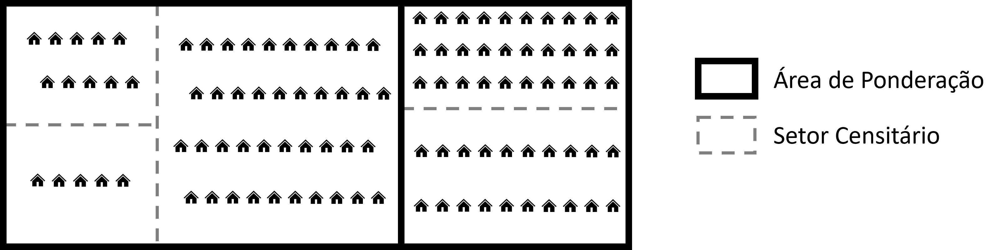
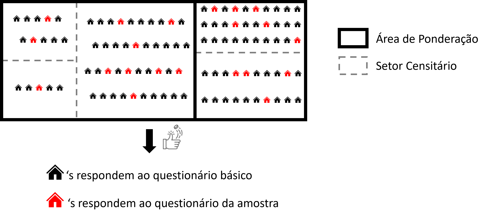
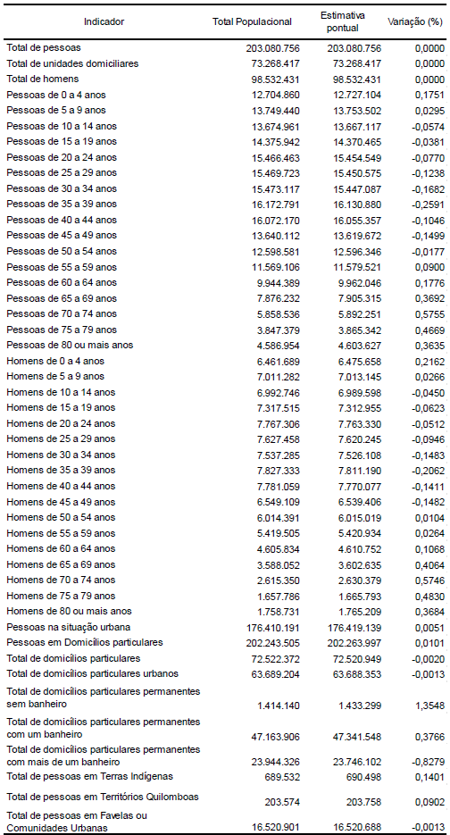

```{r}
#| label: setup
#| include: false
knitr::opts_chunk$set(cache = TRUE)
```

## Introdução

Nos dois capítulos anteriores, introduzimos conceitualmente o Censo Demográfico e aprendemos a explorar um dos seus principais produtos, os Agregados por Setor Censitário. Todavia, os Agregados são limitados com relação aos possíveis aspectos sociodemográficos que são possíveis de analisar a partir do Censo, já que referem-se somente aos itens levantados no Questionário Básico. Neste capítulo, apresentaremos um produto distinto e complementar, os **microdados da amostra do Censo Demográfico**, que permitem análises muito mais ricas em termos de variáveis, embora ao custo de uma resolução espacial menor.

A modalidade amostral do Censo tem raízes na edição de 1960, quando o Brasil adotou técnicas de amostragem probabilística na coleta censitária. A partir de então, os resultados passaram a ser organizados em dois grupos distintos: os **Resultados do Universo**, obtidos do Questionário Básico aplicado a todos os domicílios, e os **Resultados da Amostra**, provenientes do Questionário da Amostra aplicado a uma fração deles. Os microdados são a forma mais desagregada de divulgação dos Resultados da Amostra, com os registros individuais de cada domicílio e morador entrevistados^[daí se origina a nomenclatura *microdados*].

Ao contrário dos agregados por setor, os microdados não vêm com totais pré-calculados para áreas diferentes do território, mas sim com os valores individuais de cada variável para cada domicílio ou pessoa. É o pesquisador quem decide quais estatísticas calcular e como organizá-las. Essa riqueza temática é possível porque os microdados registram todas as variáveis do **Questionário da Amostra**, o instrumento mais completo do Censo. Esse questionário contém todos os quesitos do Questionário Básico (26 questões no Censo 2022 e 34 no de 2010) e um conjunto adicional de temas, como outras características dos domicílios (ex.: acesso a Internet e quantidade de cômodos) e dos indivíduos (ex.: nupcialidade, fecundidade, religião, deficiência, migração e deslocamento para estudo/trabalho) [@ibge_nota_am2022]. Em 2022, o questionário da amostra foi composto 77 questões, uma redução importante em relação ao questionário de 2010, que contava com 102 quesitos. Em ambas as edições, o questionário foi respondido por aproximadamente 1 de cada 10 domicílios brasileiros, com a fração variando conforme o porte do município, como veremos adiante.

Em contrapartida, a menor unidade geográfica identificável nos microdados é a **área de ponderação**, um agrupamento de setores censitários descrito em detalhe na @sec-areas-pond. Esse recorte é bastante mais amplo que o setor censitário, já que uma área de ponderação contém, no mínimo, 400 domicílios particulares ocupados na amostra. Para se ter uma ideia, no Censo de 2010, o maior município do país, São Paulo-SP, possuía 5082 setores censitários e somente 107 áreas de ponderação. Em municípios menores, ela corresponde ao município inteiro. Isso significa que análises espacialmente detalhadas (como as possíveis com os agregados por setor) ficam fora do alcance dos microdados. No entanto, para estudar variáveis que o Questionário Básico não cobre como migração, fertilidade, deficiências e tempo de deslocamento, os microdados são o único caminho.

::: {.callout-warning}
## Microdados do Censo 2022 ainda não disponíveis

No momento da escrita deste capítulo (início de abril de 2026), o IBGE ainda não havia divulgado os microdados da amostra do Censo Demográfico 2022. Todos os exemplos práticos das seções 4 e 5 utilizam dados do Censo de 2010, acessados via pacote `censobr`. Os conceitos e procedimentos apresentados são equivalentes para ambas as edições, e os códigos deverão funcionar para 2022 com ajustes mínimos após a divulgação dos dados.
:::

## Aspectos metodológicos

### O plano amostral

Para que somente parte dos domicílios precise responder ao Questionário da Amostra, o IBGE realiza uma **amostragem probabilística** no interior de cada setor censitário. Em cada setor, uma fração fixa de domicílios particulares é selecionada por sorteio aleatório. <!--O setor censitário é, portanto, o estrato do plano, com a seleção ocorrendo de forma independente dentro de cada um, e nenhum domicílio é selecionado com base no que ocorreu nos demais setores.-->

Quando um domicílio é selecionado, todos os seus moradores são entrevistados. Isso cria dois regimes de amostragem distintos para os dois arquivos de microdados, cuja distinção tem consequências diretas para a análise, como veremos na @sec-survey:

- **Microdados de domicílios:** amostragem aleatória estratificada simples de domicílios, com estratos nos setores censitários.
- **Microdados de pessoas:** amostragem estratificada e conglomerada, com estratificação nos setores censitários (estratos = setores censitários) e conglomeração nos domicílios (conglomerados = domicílios). Isso significa que os indivíduos não são sorteados diretamente, mas compõem um conglomerado inserido em um domicílio que foi selecionado.

A fração amostral aplicada aos setores de cada município depende do seu porte. A @tbl-fracoes apresenta as frações adotadas nas duas últimas edições do Censo. As frações são idênticas em 2010 e 2022, e resultam numa fração amostral média de cerca de 11% da população nacional.

```{r, warning = F}
#| label: tbl-fracoes
#| tbl-cap: "Frações amostrais dos Censo Demográficos de 2010 e 2022 por porte do município. Fonte: @ibge_metodologia2010 e @ibge_nota_am2022."
#| echo: false

tibble::tibble(
  porte = c("Até 2.500", "2.501 a 8.000", "8.001 a 20.000",
            "20.001 a 500.000", "Mais de 500.000"),
  n_muni_10 = c(260, 1912, 1749, 1604, 40),
  n_muni_22 = c(289, 1808, 1673, 1751, 49),
  fracao = c("50%", "33%", "20%", "10%", "5%")
) |>
  knitr::kable(
    col.names = c("Porte do município (habitantes)","Nº Municípios (2010)",
                  "Nº Municípios (2010)","Fração (2010 e 2022)"),
    align = c("c", "c","c", "c"),
    table.attr = 'style="width:auto"'
  ) |>
  kableExtra::kable_styling(full_width = FALSE)
```

A fração mais alta nos municípios menores garante que mesmo localidades com poucos domicílios tenham amostras de tamanho suficiente para a divulgação de resultados com qualidade estatística aceitável. Em contrapartida, nos 49 municípios com mais de 500 mil habitantes em 2022, a fração de 5% já representa volumes consideráveis de domicílios entrevistados.

Em ambas as edições, alguns distritos e subdistritos de municípios grandes receberam frações maiores que a padrão municipal, para viabilizar a divulgação de resultados em nível inframunicipal. Em 2022, o procedimento foi estendido também a Terras Indígenas, Territórios Quilombolas e Favelas e Comunidades Urbanas, que receberam frações diferenciadas chegando a 100% em alguns casos [@ibge_nota_am2022].

Esse processo de seleção amostral resultou em 6,2 milhões de domicílios com 20,6 milhões de pessoas no Censo de 2010 e 7,8 milhões de domicílios com 21,9 milhões de pessoas no Censo de 2022 [@ibge_metodologia2010; @ibge_nota_am2022]. Em ambos os casos, temos quase 11% do total da população em análise, cujos dados exploraremos mais adiante.

### Expansão da amostra

Numa pesquisa por amostragem probabilística, cada domicílio selecionado não representa apenas a si mesmo. Ele "fala" por outros domicílios que não foram sorteados. Para quantificar essa representatividade, cada domicílio da amostra recebe um **peso amostral**, que indica quantos domicílios ele representa na população. Para esclarecer esse processo, suponha um município hipotético com a seguinte configuração da @fig-config_cidade_hipo, com os 105 domicílios distribuídos em 3 áreas de ponderação e 5 setores censtiários.

{#fig-config_cidade_hipo}


Suponha que a fração amostral seja de 20% para todo esse município, implicando que 1 a cada 5 domicílios de cada setor censitário seja selecionado para compor a amostra. Uma primeira aproximação para esse peso é o inverso da fração amostral efetiva. Ou seja, cada domicílio selecionado representa aproximadamente 5 outros domicílios (pois, $1/0,20 = 5$). Deste modo, poderíamos aleatoriamente selecionar os seguintes domicílios na cor vermelha conforme a @fig-domicilios_sorteados no município hipotético. Nesse processo, cada recebe peso amostral igual a 5 (ou seja, representam 5 domicílios em seu setor). <!-- Domicílios em setores com frações distintas recebem pesos distintos, o que introduz probabilidades de seleção desiguais entre domicílios de municípios de portes diferentes.-->

{#fig-domicilios_sorteados}

Esse peso inicial, porém, pode não refletir adequadamente a distribuição real da população. Por acaso, a amostra pode ter capturado um número menor de pessoas de 0 a 15 anos ou mais pessoas do sexo feminino em comparação ao que se sabe do universo naquela região. Para corrigir essa variação aleatória, o IBGE realiza um processo de **calibração** destes pesos.

A calibração consiste em ajustar os pesos iniciais de maneira que as estimativas da amostra se aproximem dos totais já conhecidos para um conjunto de variáveis *auxiliares*. Tais variáveis são obtidas de quesitos que existem em ambos os questionários (Básico e da Amostra), ou seja, correspondem a totais populacionais conhecidos do processo de levantamento do Censo. 

O método de calibração baseia-se em uma estratégia de Mínimos Quadrados Generalizados (MQG), considerando as propostas de @bankier1992 e @deville1993, similar ao empregado em outros Censos, como o canadense [@ibge_metodologia2010; @ibge_nota_am2022]. Questões metodológicas específicas sobre amostragem complexa não são o foco deste livro, mas o(a) leitor(a) interessado pode ganhar mais profundidade teórica e prática consultando as obras de @silva2021amostragem, @lumley2011 e @zimmer2024.

É importante destacar que esse processo de calibração é realizado no nível da área de *ponderação*, que recebe esse nome  justamente por servir como unidade espacial onde se realiza a calibração dos pesos. Nesse sentido, as **restrições de calibração** consistem em impor que os totais populacionais das variáveis auxiliares se aproximem da estimativa obtida a partir somente das informações da amostra expandida (multiplicada por estes pesos) neste nível de desagregação espacial. 

Em 2010, foram consideradas 40 restrições, incluindo total de pessoas, total de domicílios, distribuição por sexo e faixas etárias detalhadas [@ibge_metodologia2010]. Em 2022, o conjunto foi ampliado para 47 restrições, com a adição de Terras Indígenas, Territórios Quilombolas, Favelas e Comunidades Urbanas, além de categorias de número de banheiros nos domicílios particulares permanentes [@ibge_nota_am2022].

É importante mencionar que para evitar pesos extremos (muito pequenos ou muito grandes) que poderiam distorcer as estimativas, são impostos limites aos pesos calibrados. Na prática, considerando os pesos inicial e calibrado de cada domicílio como $w$ e $w^*$, respectivamente, os pesos calibrados dos domicílios não podem ser nem inferiores a 1/5 ($w^*\ge w/5$) nem superiores a 5 vezes ($w^*\ge 5w$) o valor deste peso inicial^[Na prática, a notação é $w_{ai}$ e $w^*_{ai}$, que representa o peso do domicílio $i$ na área de ponderação $a$, mas mantemos sem os índices aqui por propósitos didáticos] [@ibge_nota_am2022]^. 

O produto final é um único peso calibrado para cada domicílio da amostra, que é replicado para todos os seus moradores. Esse peso, armazenado na variável `V0010` para os dados do Censo de 2010<!--Atualizar quando for 2022!!!-->, é o que utilizaremos em toda a análise. O IBGE recomenda que ele seja mantido como valor fracionário (com 10 casas decimais), pois o arredondamento para valores inteiros rompe a consistência das restrições de calibração [@ibge_nota_am2022]. 

Na tabela da @fig-vars_aux_censo22 abaixo, obtida de um *screenshot* do documento metodológico do Censo de 2022 [@ibge_nota_am2022], é possível evidenciar o resultado desse processo de calibração para o Censo de 2022, comparando as diferenças entre os totais observados e os totais estimados com os pesos amostrais calibrados. Observe, as diferenças são sempre menores que 1%, à exceção da variável *Total de domicílios particulares permanentes sem banheiro* (~1,35%).

{#fig-vars_aux_censo22}

### Áreas de ponderação (aspectos metodológicos) {#sec-areas-pond}

Conforme mencionado anteriormente, a **área de ponderação** é o recorte geográfico mais desagregado para o qual os microdados da amostra podem ser divulgados publicamente. No Censo de 2010, estamos falando de 10.184 áreas de ponderação compreendendo os cerca de 313 mil setores censitários. Para o Censo de 2022, temos, até o presente momento^[início de Abril de 2026<!--Atualizar aqui-->], somente áreas de ponderação preliminares (cuja malha espacial  não foi divulgada), com pesos calibrados para a produção de alguns resultados parciais. Eles compõem um total de 10.607 áreas de ponderação, que abrangem os 468 mil setores censitários do país. <!-- Atualizar aqui-->

Dois critérios justificam essa escolha. O primeiro é a **precisão estatística**, já que domínios geográficos muito pequenos produzem estimativas com erros amostrais elevados. O segundo é a **proteção da confidencialidade**, já que identificar unidades geográficas menores nos microdados públicos permitiria, em muitas situações, identificar domicílios ou indivíduos específicos.

A formação das áreas de ponderação obedece a três critérios simultâneos: (i) **contiguidade** dos setores que a compõem; (ii) **tamanho mínimo** de 400 domicílios particulares ocupados na amostra; e (iii) **homogeneidade socioeconômica** interna. Em 2022, a homogeneidade foi maximizada por um algoritmo baseado em oito variáveis dos setores censitários, entre elas renda média do responsável, proporção de domicílios na rede de esgoto e estrutura etária da população [@ibge_nota_am2022].

O método de formação varia conforme o porte do município. Em municípios com menos de 100 mil habitantes nos quais é possível formar pelo menos duas áreas, o processo é automático, via algoritmo em R desenvolvido pelo IBGE. Em municípios com mais de 100 mil habitantes, os técnicos do Instituto realizam o agrupamento manualmente, utilizando as áreas de ponderação do Censo 2010 como referência e fazendo ajustes com base em critérios de homogeneidade e morfologia urbana. Municípios com uma única área cobrem o território municipal por inteiro.

## Os pacotes survey e srvyr {#sec-survey}

Como discutido na seção anterior, os microdados da amostra têm uma estrutura amostral complexa. A seleção foi feita por amostragem estratificada (estratos nos setores censitários) nos domicílios, com uma etapa adicional de conglomeração no caso de indivíduos. Cada observação tem um peso diferente resultante da calibração. Calcular estatísticas sem levar essa estrutura em conta produz estimativas que, para as médias e totais, podem estar razoavelmente corretas, mas com **erros-padrão incorretos** (geralmente subestimados). Isso faz com que intervalos de confiança sejam mais estreitos do que deveriam, o que pode levar a conclusões equivocadas sobre a significância das diferenças encontradas.

O pacote `survey` para R [@survey_pkg] foi desenvolvido especificamente para lidar com esse problema. A ideia é implementar estimadores e métodos de estimação de variância corretos para amostras complexas, incorporando automaticamente os pesos, a estratificação e a conglomeração em todos os cálculos. Vale salientar que o pacote `survey` é inclusive a solução utilizada pelo corpo técnico do IBGE no processo de calibração dos pesos desde o Censo de 2010 [@ibge_metodologia2010; @ibge_nota_am2022]. O ponto de partida é a criação de um **objeto de desenho amostral** (*survey design object*) com a função `svydesign()`, que armazena os dados junto com a especificação do plano de amostragem. Todas as funções de análise recebem esse objeto em vez do *data frame* original.

Já o pacote `srvyr` [@srvyr_pkg] é uma extensão do `survey` que oferece uma interface no estilo tidyverse. O objeto de desenho é criado com `as_survey_design()`, que aceita os mesmos argumentos de `svydesign()` mas sem fórmulas, de modo a se integrar naturalmente ao fluxo `|>`. A análise por grupos usa `group_by()` e `summarize()`, exatamente como no `dplyr`.

A @tbl-survey-srvyr apresenta as principais funções equivalentes entre os dois pacotes.

```{r, warning = F}
#| label: tbl-survey-srvyr
#| tbl-cap: "Funções equivalentes nos pacotes `survey` e `srvyr`."
#| echo: false

tibble::tibble(
  Tarefa = c(
    "Criar objeto de plano amostral",
    "Média",
    "Total",
    "Mediana / quantis",
    "Proporção",
    "Estatísticas por grupo"
  ),
  survey = c(
    "`svydesign()`",
    "`svymean()`",
    "`svytotal()`",
    "`svyquantile()`",
    "`svymean()`",
    "`svyby()`"
  ),
  srvyr = c(
    "`as_survey_design()`",
    "`survey_mean()`",
    "`survey_total()`",
    "`survey_median()` / `survey_quantile()`",
    "`survey_prop()`",
    "`group_by()` + `summarize()`"
  )
) |>
  knitr::kable(
    col.names = c("Tarefa", "`survey`", "`srvyr`"),
    align = c("l", "c", "c")
  )
```

Nos exemplos das próximas seções, usaremos exclusivamente o `srvyr`. Leitores que preferirem o `survey` podem consultar @lumley2011 e @zimmer2024 para a sintaxe equivalente. Eles se baseiam no tutorial de @silva2017censo, apresentado no 6º Seminário de Metodologia do IBGE em 2017. Para quem deseja aprofundar em fundamentos metodológicos de amostragem complexa, com foco especial no Censo Demográfico brasileiro, o livro de @pessoa1998analise é uma referência clássica na área.

## Analisando microdados de domicílios {#sec-dom}

Esta seção e a próxima (@sec-ind) percorrem o ciclo completo de trabalho com microdados do Censo, desde a obtenção dos dados brutos à visualização dos resultados. A seção atual trata dos microdados de domicílios e a seguinte dos microdados de indivíduos. Em ambas, usamos Belo Horizonte como município de exemplo, o que nos permite explorar um contexto urbano de grande porte com diversidade interna expressiva. Como os microdados da amostra do Censo 2022 ainda não foram divulgados pelo IBGE no momento da escrita deste capítulo, todos os exemplos utilizam dados do Censo de 2010, acessados via pacote `censobr`.

### Obtendo e preparando os dados

O ponto de partida é carregar os pacotes necessários para as duas seções.

```{r}
#| label: pacotes
#| cache: false
#| message: false
#| warning: false
library(tidyverse)
library(censobr)
library(geobr)
library(survey)
library(srvyr)
```

Antes de ler os dados, vale consultar o dicionário de variáveis do arquivo de domicílios. A função `data_dictionary()` do `censobr` abre uma tabela interativa com nomes, descrições e categorias de cada variável disponível. Com centenas de colunas nos arquivos de microdados, esse passo é essencial para identificar as variáveis de interesse antes de qualquer leitura.

```{r}
#| label: dicionario-dom
#| eval: false
censobr::data_dictionary(year = 2010, dataset = 'households')
```

Com o dicionário em mãos, o passo seguinte é obter a geometria das áreas de ponderação de Belo Horizonte (código IBGE 3106200) com a função `read_weighting_area()` do `geobr`. Com ele, poderemos visualizar espacialmente os resultados nos mapas produzidos adiante e selecionar os códigos das áreas de ponderação a serem utilizados para filtrar os microdados de BH.

```{r}
#| label: fig-bh-areas
#| fig-cap: "Áreas de ponderação de Belo Horizonte, Censo Demográfico 2010."
#| cache: true
#| message: false
#| warning: false
ap_bh <- geobr::read_weighting_area(
  code_weighting = 3106200,
  year = 2010,
  simplified = FALSE
)

ggplot(ap_bh) +
  geom_sf(fill = "gray92", color = "gray60", linewidth = 0.3) +
  theme_minimal() +
  labs(title = NULL)
```

O mapa revela uma característica importante das áreas de ponderação: elas são menores nas regiões centrais e mais densas da cidade, onde o número de domicílios por quilômetro quadrado permite formar recortes compactos que atendam ao mínimo de 400 domicílios na amostra. Nas bordas periféricas, onde a densidade é menor, as áreas tendem a ser maiores em extensão territorial.

Com os códigos das áreas de ponderação em mãos, podemos ler os microdados. A função `read_households()` do `censobr` retorna os dados de todo o Brasil como um *Arrow Table* (via pacote `arrow`), sem carregá-los para a memória imediatamente. O filtro por `code_weighting` seleciona apenas os domicílios de Belo Horizonte, e `collect()` materializa o resultado em um *data frame* convencional. Selecionaremos também apenas as variáveis de interesse, o que reduz consideravelmente o volume de dados em memória.

```{r}
#| label: leitura-dom
#| cache: true
#| message: false
#| warning: false

## Códigos das áreas de ponderação de BH
ap_bh_cods <- ap_bh |>
  pull(code_weighting)

## Variáveis selecionadas do arquivo de domicílios
cols_dom <- c(
  'V0300',          # Identificador do domicílio (controle)
  'V0010',          # Peso amostral calibrado
  'V1006',          # Situação do domicílio (urbano/rural)
  'code_weighting', # Área de ponderação
  'V4001',          # Tipo de domicílio
  'V0201',          # Condição de ocupação (próprio, alugado, ...)
  'V6203',          # Densidade (moradores por cômodo)
  'V0207',          # Tipo de esgotamento sanitário
  'V6531',          # Rendimento domiciliar per capita
  'V0222'           # Automóvel particular (sim/não)
)

## Leitura e filtragem para BH
md_dom_bh <- censobr::read_households(year = 2010, columns = cols_dom) |>
  filter(code_weighting %in% ap_bh_cods) |>
  collect()
```

### Declarando o plano amostral

Para que qualquer estimativa produzida com os microdados seja estatisticamente válida, é preciso declarar ao `srvyr` como os dados foram coletados. Sem essa declaração, as funções de resumo tratariam os dados como uma amostra aleatória simples, ignorando a estratificação e os pesos calibrados, o que produziria erros-padrão incorretos e intervalos de confiança inadequados.

O plano amostral dos domicílios é caracterizado por três elementos. O primeiro é a **estratificação**: como a calibração foi realizada no nível da área de ponderação, cada área de ponderação constitui um estrato amostral independente. O segundo é a **unidade amostral**, que no arquivo de domicílios é o próprio domicílio: cada linha representa um domicílio sorteado diretamente, sem conglomeração adicional. O terceiro são os **pesos calibrados**, armazenados na variável `V0010`, que indicam quantos domicílios da população cada observação representa.

Há ainda um quarto elemento, a **correção de população finita** (`fpc`, de *finite population correction*). Ela ajusta os erros-padrão quando a fração amostral não é desprezível. Para calculá-la, somamos os pesos dentro de cada área de ponderação, obtendo uma estimativa do total de domicílios naquele estrato.

```{r}
#| label: plano-amostral-dom
#| message: false

## Total de domicílios expandido por área de ponderação (para correção de finitude)
dom_ap <- md_dom_bh |>
  group_by(code_weighting) |>
  summarize(n_dom = sum(V0010))

## Adiciona n_dom ao arquivo de domicílios
md_dom_bh <- md_dom_bh |>
  left_join(dom_ap, by = join_by(code_weighting))

## Objeto de desenho amostral (srvyr)
pa_dom <- md_dom_bh |>
  as_survey_design(
    ids     = 1,               # cada linha é um domicílio (unidade sorteada)
    strata  = code_weighting,  # estratos = áreas de ponderação (onde a calibração foi feita)
    weights = V0010,           # pesos calibrados
    fpc     = n_dom            # total de domicílios em cada área (correção de população finita)
  )
```

O objeto `pa_dom` reúne os dados e a especificação completa do plano amostral. Todas as funções de análise do `srvyr` a seguir receberão esse objeto, garantindo que as estimativas levem em conta a estratificação e os pesos.

### Calculando estatísticas {#sec-dom-estat}

Com o plano amostral configurado, podemos calcular estimativas ponderadas para qualquer variável dos microdados. O fluxo de trabalho é similar ao do `dplyr`, com `summarize()` para estatísticas do município como um todo e `group_by()` para análises por subgrupos.

Começamos estimando a média e a mediana do rendimento domiciliar per capita (`V6531`) em Belo Horizonte. Os argumentos `vartype = "ci"` e `level = 0.95` solicitam que o resultado inclua os limites inferior e superior do intervalo de confiança de 95%.

```{r}
#| label: tbl-renda-bh
#| tbl-cap: "Rendimento domiciliar per capita em Belo Horizonte (R$), Censo 2010."
#| message: false
pa_dom |>
  summarize(
    renda_media   = survey_mean(V6531, na.rm = TRUE,
                                vartype = "ci", level = 0.95),
    renda_mediana = survey_median(V6531, na.rm = TRUE,
                                  vartype = "ci", level = 0.95)
  ) |>
  knitr::kable(
    col.names = c("Média", "IC inf. (média)", "IC sup. (média)",
                  "Mediana", "IC inf. (mediana)", "IC sup. (mediana)"),
    digits = 1
  )
```

A mediana é substancialmente menor que a média, o que reflete a assimetria positiva da distribuição de renda. Uma minoria de domicílios com rendimentos muito altos eleva a média sem deslocar a mediana, tornando esta última a medida mais representativa da renda típica.

Uma comparação natural é verificar como a posse de automóvel particular (`V0222`) se associa ao rendimento domiciliar. O gráfico a seguir apresenta a renda mediana estimada para cada categoria, com o respectivo intervalo de confiança de 95%.

```{r}
#| label: fig-renda-automovel
#| fig-cap: "Rendimento domiciliar per capita mediano por posse de automóvel, Belo Horizonte (Censo 2010). Barras de erro indicam IC 95%."
#| message: false
pa_dom |>
  filter(!is.na(V0222)) |>
  group_by(V0222) |>
  summarize(
    renda_mediana = survey_median(V6531, na.rm = TRUE,
                                  vartype = "ci", level = 0.95)
  ) |>
  mutate(V0222 = factor(V0222,
                        levels = c("1", "2"),
                        labels = c("Com automóvel", "Sem automóvel"))) |>
  ggplot(aes(x = V0222, y = renda_mediana,
             ymin = renda_mediana_low, ymax = renda_mediana_upp)) +
  geom_col(fill = "steelblue", alpha = 0.85, width = 0.5) +
  geom_errorbar(width = 0.15, color = "gray30") +
  scale_y_continuous(
    labels = scales::label_dollar(prefix = "R$ ", big.mark = ".", decimal.mark = ",")
  ) +
  labs(x = NULL, y = "Renda mediana (R$)") +
  theme_minimal()
```

A diferença entre os dois grupos é expressiva, e como os intervalos de confiança não se sobrepõem, ela é estatisticamente significativa. Domicílios com automóvel apresentam renda per capita mediana substancialmente maior, resultado esperado dado o custo de aquisição e manutenção de um veículo próprio.

Os microdados também permitem estimar proporções para variáveis categóricas. O gráfico a seguir apresenta a distribuição de domicílios por condição de ocupação (`V0201`), com a proporção estimada e o intervalo de confiança de 95% para cada categoria.

```{r}
#| label: fig-condicao-ocup
#| fig-cap: "Proporção de domicílios por condição de ocupação, Belo Horizonte (Censo 2010). Barras de erro indicam IC 95%."
#| message: false
pa_dom |>
  group_by(V0201) |>
  summarize(
    proporcao = survey_prop(vartype = "ci", level = 0.95)
  ) |>
  ggplot(aes(x = reorder(V0201, proporcao), y = proporcao,
             ymin = proporcao_low, ymax = proporcao_upp)) +
  geom_col(fill = "steelblue", alpha = 0.85) +
  geom_errorbar(width = 0.3, color = "gray30") +
  coord_flip() +
  scale_y_continuous(labels = scales::label_percent(decimal.mark = ",")) +
  labs(x = NULL, y = "Proporção") +
  theme_minimal()
```

Por fim, calculamos a proporção de domicílios atendidos por rede geral de esgoto ou pluvial (categoria `'1'` da variável `V0207`), um indicador clássico de cobertura de saneamento básico.

```{r}
#| label: fig-esgoto-bh
#| fig-cap: "Proporção de domicílios por tipo de esgotamento sanitário, Belo Horizonte (Censo 2010). Barras de erro indicam IC 95%."
#| message: false
pa_dom |>
  mutate(esg_rede = factor(ifelse(V0207 == '1', 'Rede geral', 'Outro'))) |>
  group_by(esg_rede) |>
  summarize(proporcao = survey_prop(vartype = "ci", level = 0.95)) |>
  ggplot(aes(x = esg_rede, y = proporcao,
             ymin = proporcao_low, ymax = proporcao_upp)) +
  geom_col(fill = "steelblue", alpha = 0.85, width = 0.5) +
  geom_errorbar(width = 0.15, color = "gray30") +
  scale_y_continuous(labels = scales::label_percent(decimal.mark = ",")) +
  labs(x = NULL, y = "Proporção") +
  theme_minimal()
```

### Produzindo mapas

As mesmas estatísticas calculadas para o município como um todo podem ser desagregadas por área de ponderação com `group_by(code_weighting)` e visualizadas espacialmente com `geom_sf()`. O mapa da @fig-bh-renda apresenta a renda domiciliar per capita mediana em cada área de ponderação. Para isso, calculamos a mediana por área com `survey_median()` e depois unimos o resultado à geometria com `left_join()`.

```{r}
#| label: fig-bh-renda
#| fig-cap: "Rendimento domiciliar per capita mediano por área de ponderação, Belo Horizonte (Censo 2010, R$ de julho de 2010)."
#| cache: true
#| message: false
#| warning: false

## Estatística por área de ponderação
rend_ap <- pa_dom |>
  group_by(code_weighting) |>
  summarize(rend_mediana = survey_median(V6531, na.rm = TRUE))

## Join com geometria e mapa
ap_bh |>
  left_join(rend_ap, by = join_by(code_weighting)) |>
  ggplot() +
  geom_sf(aes(fill = rend_mediana), color = "white", linewidth = 0.2) +
  scale_fill_distiller(
    palette = "RdYlGn",
    direction = 1,
    name = "Renda mediana\n(R$)",
    labels = scales::label_dollar(prefix = "R$ ", big.mark = ".", decimal.mark = ",")
  ) +
  theme_minimal() +
  theme(
    axis.text = element_blank(),
    axis.ticks = element_blank(),
    panel.grid = element_blank()
  )
```

O padrão espacial é marcante: as áreas com rendimentos mais altos concentram-se na região Centro-Sul e na Zona Sul do município, enquanto os menores rendimentos predominam nas periferias norte e nordeste. Esse gradiente reflete uma estrutura de segregação socioespacial historicamente consolidada na metrópole.

O mapa da @fig-bh-esgoto apresenta, para as mesmas unidades espaciais, a proporção de domicílios atendidos por rede geral de esgoto. O procedimento é idêntico ao do mapa anterior, substituindo `survey_median()` por `survey_prop()` e criando uma variável indicadora antes do agrupamento.

```{r}
#| label: fig-bh-esgoto
#| fig-cap: "Proporção de domicílios atendidos por rede geral de esgoto ou pluvial por área de ponderação, Belo Horizonte (Censo 2010)."
#| cache: true
#| message: false
#| warning: false

## Estatística por área de ponderação
esg_ap <- pa_dom |>
  mutate(esg_rede = factor(ifelse(V0207 == '1', 'Rede geral', 'Outro'))) |>
  group_by(code_weighting, esg_rede) |>
  summarize(proporcao = survey_prop()) |>
  filter(esg_rede == 'Rede geral')

## Join com geometria e mapa
ap_bh |>
  left_join(esg_ap, by = join_by(code_weighting)) |>
  ggplot() +
  geom_sf(aes(fill = proporcao), color = "white", linewidth = 0.2) +
  scale_fill_distiller(
    palette = "Blues",
    direction = 1,
    name = "Proporção",
    labels = scales::label_percent(decimal.mark = ",")
  ) +
  theme_minimal() +
  theme(
    axis.text = element_blank(),
    axis.ticks = element_blank(),
    panel.grid = element_blank()
  )
```

Comparando os dois mapas, observa-se uma correlação positiva entre renda e cobertura de saneamento. As áreas com maior rendimento tendem a apresentar maior proporção de domicílios atendidos pela rede geral de esgoto. A relação, contudo, não é perfeita, e identificar onde o saneamento está aquém do esperado dado o nível de renda é exatamente o tipo de diagnóstico que os microdados da amostra viabilizam.

## Analisando microdados de indivíduos {#sec-ind}

### Obtendo e preparando os dados

O arquivo de pessoas do Censo segue a mesma lógica de acesso que o de domicílios, mas exige atenção especial na especificação do plano amostral. Como discutido na @sec-survey, os indivíduos não foram sorteados diretamente. O que foi sorteado foi o domicílio, e todos os seus moradores foram entrevistados. Essa estrutura conglomerada precisa ser declarada explicitamente, como veremos adiante.

Assim como no arquivo de domicílios, vale consultar o dicionário antes de iniciar a leitura.

```{r}
#| label: dicionario-ind
#| eval: false
censobr::data_dictionary(year = 2010, dataset = 'population')
```

O código a seguir seleciona as variáveis de interesse e lê os microdados de indivíduos de Belo Horizonte, aproveitando os códigos de área de ponderação já extraídos anteriormente.

```{r}
#| label: leitura-ind
#| cache: true
#| message: false
#| warning: false

## Variáveis selecionadas do arquivo de pessoas
cols_ind <- c(
  'V0300',          # Identificador do domicílio (controle, usado como id do conglomerado)
  'V0010',          # Peso amostral calibrado
  'V1006',          # Situação do domicílio (urbano/rural)
  'code_weighting', # Área de ponderação
  'V0601',          # Sexo
  'V0606',          # Cor ou raça
  'V6036',          # Idade (em anos)
  'V6400',          # Nível de instrução
  'V0661',          # Retorna do trabalho para casa diariamente?
  'V0662'           # Tempo habitual de deslocamento até o trabalho
)

## Leitura e filtragem para BH
md_ind_bh <- censobr::read_population(year = 2010, columns = cols_ind) |>
  filter(code_weighting %in% ap_bh_cods) |>
  collect()
```

### Declarando o plano amostral

O plano amostral de indivíduos difere do de domicílios em um aspecto fundamental: a declaração da conglomeração. No arquivo de pessoas, os moradores não chegaram à amostra de forma independente. Foram os domicílios que foram sorteados, e cada morador pertence a um conglomerado (seu domicílio). Dois moradores do mesmo domicílio tendem a ter características muito mais similares entre si do que dois indivíduos escolhidos ao acaso na população. Ignorar essa estrutura leva a erros-padrão subestimados, porque o `srvyr` contaria cada observação como se fosse independente, quando na verdade membros de uma mesma família contribuem com informação redundante.

Para informar a conglomeração ao `srvyr`, usamos o argumento `ids = V0300`, em que `V0300` é o identificador do domicílio. Com isso, o pacote entende que todos os indivíduos com o mesmo `V0300` foram coletados juntos, como parte do mesmo conglomerado. O `fpc` passa a ser o total expandido de pessoas por área de ponderação.

```{r}
#| label: plano-amostral-ind
#| message: false

## Total de indivíduos expandido por área de ponderação (para correção de finitude)
pop_ap <- md_ind_bh |>
  group_by(code_weighting) |>
  summarize(n_ind = sum(V0010))

## Adiciona n_ind ao arquivo de pessoas
md_ind_bh <- md_ind_bh |>
  left_join(pop_ap, by = join_by(code_weighting))

## Objeto de desenho amostral (srvyr)
pa_ind <- md_ind_bh |>
  as_survey_design(
    ids     = V0300,           # domicílio = unidade de conglomeração
    strata  = code_weighting,  # estratos = áreas de ponderação
    weights = V0010,           # pesos calibrados
    fpc     = n_ind            # total de pessoas em cada área (correção de finitude)
  )
```

### Calculando estatísticas

Com o plano amostral de indivíduos configurado, podemos explorar variáveis que o Questionário Básico não cobre. Começamos com a distribuição por cor ou raça (`V0606`). O gráfico a seguir apresenta a proporção estimada para cada grupo, com intervalo de confiança de 95%.

```{r}
#| label: fig-raca-bh
#| fig-cap: "Distribuição da população por cor ou raça, Belo Horizonte (Censo 2010). Barras de erro indicam IC 95%."
#| message: false
pa_ind |>
  group_by(V0606) |>
  summarize(
    proporcao = survey_prop(vartype = "ci", level = 0.95)
  ) |>
  mutate(V0606 = factor(V0606,
                        levels = c("1", "2", "3", "4", "5"),
                        labels = c("Branca", "Preta", "Amarela", "Parda", "Indígena"))) |>
  ggplot(aes(x = reorder(V0606, -proporcao), y = proporcao,
             ymin = proporcao_low, ymax = proporcao_upp)) +
  geom_col(fill = "steelblue", alpha = 0.85) +
  geom_errorbar(width = 0.3, color = "gray30") +
  scale_y_continuous(labels = scales::label_percent(decimal.mark = ",")) +
  labs(x = NULL, y = "Proporção") +
  theme_minimal()
```

O tempo de deslocamento ao trabalho (`V0662`) é uma das poucas perguntas sobre mobilidade disponíveis no Censo. O gráfico a seguir restringe a análise às pessoas que retornavam diariamente para casa (`V0661 == '1'`) e compara a distribuição dos tempos de deslocamento entre os três principais grupos de cor ou raça, com intervalos de confiança de 95%. Focamos nos grupos Branca, Preta e Parda por concentrarem a quase totalidade da população de Belo Horizonte.

```{r}
#| label: fig-desloc-raca
#| fig-cap: "Distribuição do tempo de deslocamento ao trabalho por cor ou raça, Belo Horizonte, Censo 2010 (trabalhadores que retornam diariamente). Barras de erro indicam IC 95%."
#| message: false
pa_ind |>
  filter(V0661 == '1', V0606 %in% c("1", "2", "4")) |>
  mutate(
    V0606 = factor(V0606,
                   levels = c("1", "2", "4"),
                   labels = c("Branca", "Preta", "Parda"))
  ) |>
  group_by(V0606, V0662) |>
  summarize(proporcao = survey_prop(vartype = "ci", level = 0.95)) |>
  ggplot(aes(x = V0662, y = proporcao,
             ymin = proporcao_low, ymax = proporcao_upp,
             fill = V0606)) +
  geom_col(position = "dodge", alpha = 0.85) +
  geom_errorbar(position = position_dodge(width = 0.9),
                width = 0.25, color = "gray30") +
  scale_y_continuous(labels = scales::label_percent(decimal.mark = ",")) +
  scale_fill_brewer(palette = "Set2", name = "Cor ou raça") +
  labs(x = "Tempo de deslocamento (código)", y = "Proporção") +
  theme_minimal()
```

::: {.callout-tip}
## Interpretando os códigos das variáveis

Os valores numéricos de variáveis como `V0606` (cor ou raça) e `V0662` (tempo de deslocamento) correspondem a categorias descritas no dicionário de variáveis. Para interpretá-los corretamente, consulte `censobr::data_dictionary(year = 2010, dataset = 'population')` e localize a variável de interesse. A coluna de categorias lista os valores e seus rótulos. A conversão para rótulos legíveis pode ser feita com `factor(..., levels = ..., labels = ...)` após a leitura dos dados.
:::

### Produzindo mapas

Assim como nos domicílios, as estatísticas por pessoa podem ser desagregadas por área de ponderação e mapeadas. O mapa da @fig-bh-desloc apresenta, para cada área de ponderação de Belo Horizonte, a proporção de trabalhadores com tempo de deslocamento superior a 30 minutos entre casa e trabalho, um indicador do esforço cotidiano de mobilidade. As categorias da variável `V0662` com código maior ou igual a 3 correspondem a tempos superiores a 30 minutos (confirme com `data_dictionary()` se os códigos mudaram).

```{r}
#| label: fig-bh-desloc
#| fig-cap: "Proporção de trabalhadores com tempo de deslocamento ao trabalho superior a 30 minutos por área de ponderação, Belo Horizonte (Censo 2010)."
#| cache: true
#| message: false
#| warning: false

desloc_ap <- pa_ind |>
  filter(V0661 == '1', !is.na(V0662)) |>
  mutate(desloc_longo = factor(ifelse(as.integer(V0662) >= 3,
                                      'Mais de 30 min', 'Até 30 min'))) |>
  group_by(code_weighting, desloc_longo) |>
  summarize(proporcao = survey_prop()) |>
  filter(desloc_longo == 'Mais de 30 min')

ap_bh |>
  left_join(desloc_ap, by = join_by(code_weighting)) |>
  ggplot() +
  geom_sf(aes(fill = proporcao), color = "white", linewidth = 0.2) +
  scale_fill_distiller(
    palette = "Oranges",
    direction = 1,
    name = "Proporção",
    labels = scales::label_percent(decimal.mark = ",")
  ) +
  theme_minimal() +
  theme(
    axis.text = element_blank(),
    axis.ticks = element_blank(),
    panel.grid = element_blank()
  )
```

As maiores proporções de deslocamentos longos tendem a ocorrer nas áreas periféricas do município, onde a distância até os principais centros de emprego é maior e a oferta de transporte coletivo pode ser menos densa. Sobreposto ao mapa de renda da @fig-bh-renda, esse padrão sugere uma dupla desvantagem nas periferias, com menor renda e maior esforço cotidiano de mobilidade.

::: {.callout-note}
## Combinando domicílios e indivíduos

Os dois arquivos de microdados compartilham a variável `V0300`, o identificador do domicílio. Isso permite cruzar informações dos dois arquivos, por exemplo, associar características do domicílio (tipo de esgotamento, número de cômodos) às características dos moradores (cor ou raça, escolaridade). Esse cruzamento é feito com `left_join()` antes de montar o plano amostral e pode enriquecer consideravelmente a análise.
:::

## Exercícios

1. Utilizando os microdados de domicílios de Belo Horizonte (Censo 2010), calcule a densidade média de moradores por cômodo (`V6203`) em cada área de ponderação e produza um mapa. As áreas com maior densidade coincidem com as de menor renda per capita? Sobreponha os dois mapas ou construa um gráfico de dispersão para investigar essa relação.

2. Utilizando os microdados de indivíduos de Belo Horizonte (Censo 2010), compare o nível de instrução médio (`V6400`) entre pessoas pardas, pretas e brancas, com intervalos de confiança. Repita a análise separando por sexo (`V0601`). Os padrões diferem entre homens e mulheres?

3. Replique os mapas de renda domiciliar per capita mediana e de cobertura de esgoto por rede geral para outra capital brasileira à sua escolha. Compare os padrões encontrados com os de Belo Horizonte. Qual das duas cidades apresenta maior desigualdade intraurbana nas variáveis analisadas?
